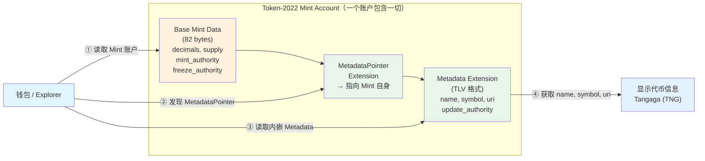
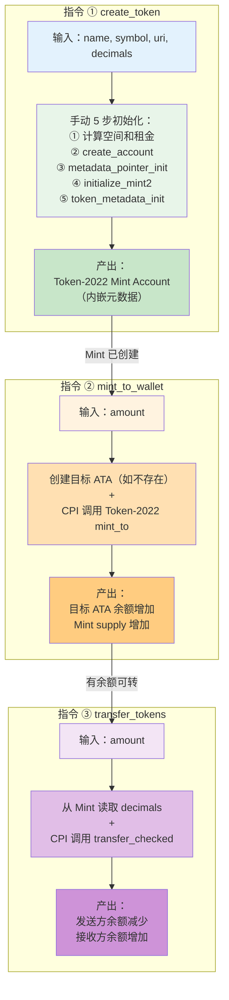
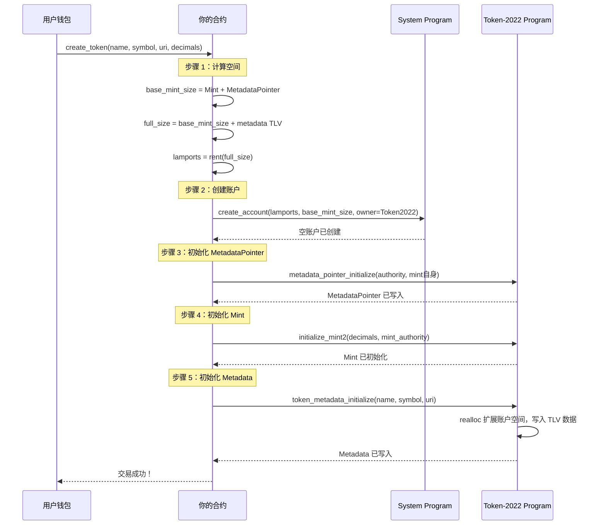
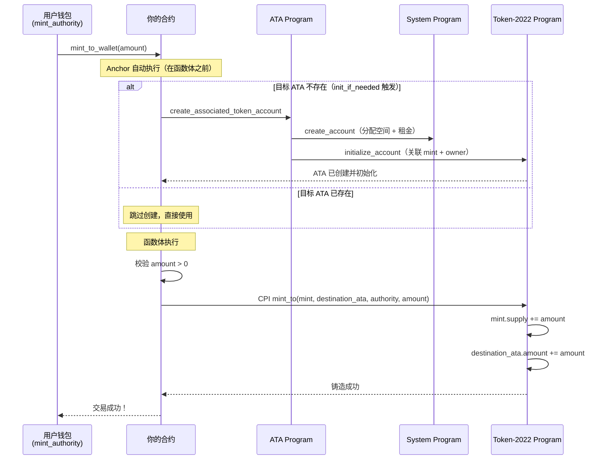
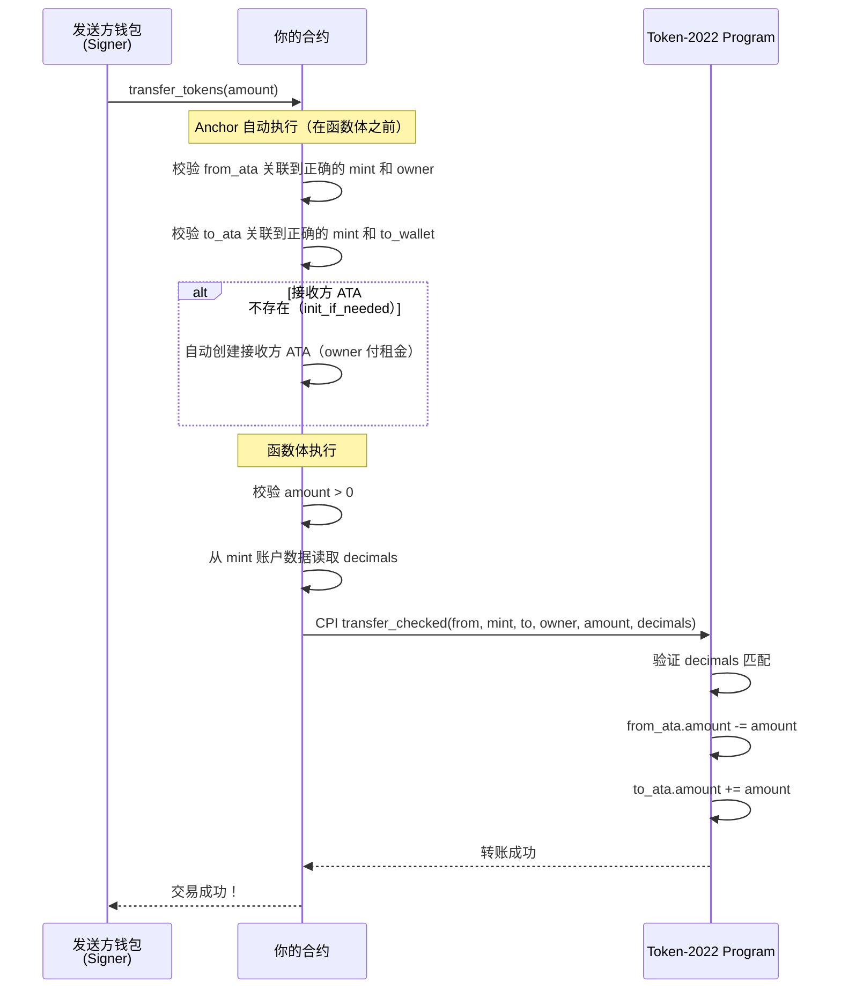
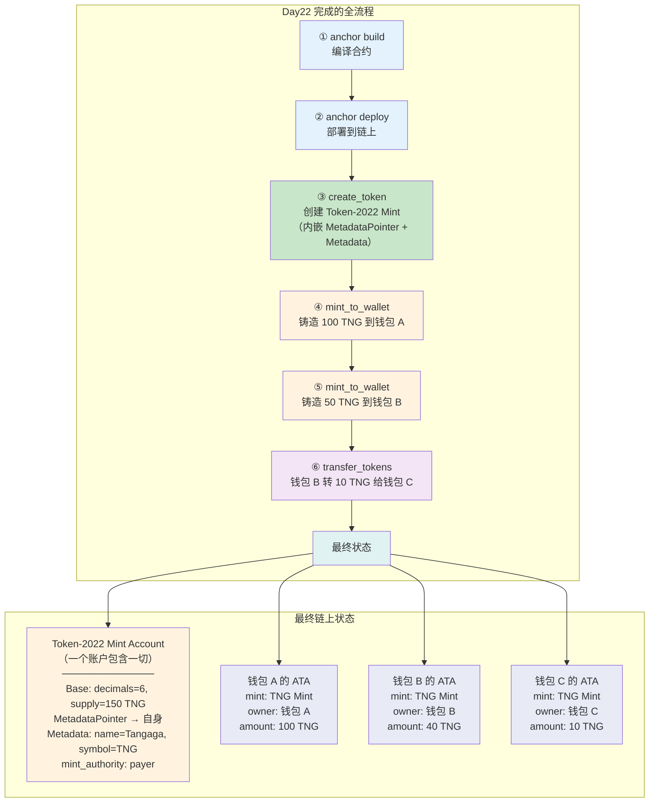

# Day22 学习指南：发行自己的代币 — Anchor + Token-2022 实战

## 学习目标

- 用 Anchor 代码（不是 CLI）完成代币发行的全流程
- 理解 SPL Token 与 Token-2022 的区别与演进
- 掌握 Token-2022 的 Extension 机制（MetadataPointer + Metadata）
- 实现完整的代币合约：创建 Token-2022 Mint（内嵌元数据）→ 铸造 → 转账
- 编写覆盖全流程的 TypeScript 测试脚本
- 目标产出：**钱包里有自己发行的代币**（能在 Solana Explorer 上看到名称和符号）

## 预计用时

5-6 小时

## 前置要求

```
Day21 已完成：
  ✅ 理解 SPL Token Program 的"一切皆账户"设计
  ✅ 掌握 Mint Account 结构（82 bytes：authority, supply, decimals）
  ✅ 掌握 Token Account 结构（165 bytes：mint, owner, amount）
  ✅ 理解 ATA 机制（PDA 推导：wallet + token_program + mint）
  ✅ 理解代币生命周期（创建 Mint → 创建 ATA → 铸造 → 转账 → 销毁）
  ✅ 使用 CLI 完成过 spl-token create-token / mint / transfer 操作

Day18-19 已完成：
  ✅ 掌握 Anchor 指令设计与 CPI 调用
  ✅ 掌握 CpiContext::new 和 CpiContext::new_with_signer
  ✅ 理解 PDA 签名机制（seeds + bump）
```

---

## 一、Day21 → Day22 的跨越

```
Day21 你做到的事情：
  理解了 SPL Token 的三大核心概念：Mint、Token Account、ATA
  用 CLI 完成了代币的创建、铸造、转账、销毁
  → 你已经知道"SPL Token 是什么、怎么用"

  但有两个问题：
  1. CLI 操作不等于代码实现 → 真实项目中需要用 Anchor 合约来操作
  2. 你的代币没有名字！→ CLI 创建的代币只有地址，没有 name/symbol/logo

Day22 要做的事：
  1. 用 Anchor 代码创建 Mint Account（不用 CLI）
  2. 用 Token-2022 的内置 Metadata Extension 给代币加名字、符号、图标
  3. 铸造代币到指定钱包的 ATA
  4. 写 TypeScript 测试脚本验证全流程
  → 完成后，你在 Solana Explorer 上能看到一个有名字、有符号的自己的代币！

Java 类比：
  Day21 = 你学会了用 MySQL 命令行建表、插数据（理解原理）
  Day22 = 你用 Spring Boot + JPA 代码来建表、插数据（工程化实现）
         + 用 Token-2022 Extension 给代币自带文档（不需要外部程序，数据直接嵌入 Mint）
```

---

## 二、为什么代币需要元数据

### 2.1 SPL Token 的"先天缺陷"

```text
Day21 学过：SPL Token 的 Mint Account 只存了 5 个字段：
  · mint_authority
  · supply
  · decimals
  · is_initialized
  · freeze_authority

注意到了吗？没有 name、symbol、logo！

→ 如果只靠 SPL Token，你的代币在钱包里显示的是：
  "Unknown Token (7xKXtg...gAsU)"
  → 没有名字、没有符号、没有图标
  → 就像一张没有标签的银行卡 → 用户不知道这是什么币

以太坊 ERC-20 的做法：
  → name()、symbol()、decimals() 直接写在合约代码里
  → 钱包调用合约方法就能获取

Solana 的做法：
  → SPL Token 不存元数据（保持简洁）
  → 元数据需要通过其他方式添加
  → 历史上有两种方案（见下节）
```

### 2.2 两种解决方案的演进

```text
方案一（旧）：Metaplex Token Metadata
  → 一个独立的链上程序（地址：metaqbxxUerdq28cj1RbAWkYQm3ybzjb6a8bt518x1s）
  → 为每个 Mint 创建一个独立的 Metadata Account（PDA）
  → 元数据存在 Mint 外部的另一个账户里
  → 需要 CPI 调用 Metaplex 程序来创建/修改元数据
  → 本地测试需要 --clone 把 Metaplex 程序克隆到 validator

  优点：生态成熟，所有钱包都支持
  缺点：依赖外部程序，多一个账户，多一次 CPI，本地测试配置复杂

方案二（新）：Token-2022 内置 Extension
  → Solana 官方推出的新一代 Token 程序（Token Extensions Program）
  → 元数据直接嵌入 Mint Account 内部（通过 Extension 机制）
  → 不需要外部程序，不需要额外账户
  → Token-2022 是 Solana 内置程序，本地 validator 自带

  优点：无外部依赖，架构更简洁，官方推荐的新标准
  缺点：较新，部分旧工具/钱包可能还在适配中
```

| 对比项 | Metaplex（旧方案） | Token-2022 Extension（新方案） |
|--------|-------------------|-------------------------------|
| 元数据存储位置 | 独立的 Metadata Account（PDA） | 嵌入 Mint Account 内部 |
| 外部依赖 | 需要 Metaplex 程序 | 无，Solana 内置 |
| 账户数量 | Mint + Metadata = 2 个 | 只需 Mint = 1 个 |
| CPI 目标 | Metaplex Program | Token-2022 Program |
| 本地测试 | 需要 `--clone` Metaplex | 直接可用 |
| Rust 依赖 | `mpl-token-metadata` crate | `anchor-spl` 的 `token_2022` feature |
| 生态支持 | 成熟，广泛支持 | 快速增长，主流钱包已支持 |

```text
本教程选择 Token-2022 的原因：
  1. Solana 官方推荐的新标准
  2. 架构更简洁（一个账户搞定一切）
  3. 无外部依赖（不需要 Metaplex）
  4. 本地开发更方便（不需要 clone 外部程序）
  5. 理解 Extension 机制对后续学习（TransferFee、ConfidentialTransfer 等）有帮助
```

### 2.3 Token-2022 Extension 机制

```text
Token-2022 的核心创新 = Extension（扩展）机制
  → 把 Mint Account 变成一个"可插拔"的容器
  → 基础数据（supply, decimals, authority）不变
  → 可以按需"插入"各种 Extension

本教程用到的两个 Extension：

1. MetadataPointer Extension
   → 告诉链上"这个 Mint 的元数据在哪里"
   → 我们设置为指向 Mint 自身（自引用模式）
   → 这样钱包/Explorer 知道去 Mint 账户内部找元数据

2. Metadata Extension（Token Metadata）
   → 实际存储 name、symbol、uri 的地方
   → 数据以 TLV（Type-Length-Value）格式追加在 Mint 账户末尾
   → 和 Metaplex 的 Metadata Account 存的信息类似，但不需要单独的账户

自引用模式（Self-Referential）：
  MetadataPointer 指向 → Mint 自身
  → 元数据就在 Mint 账户内部
  → 不需要推导 PDA，不需要额外账户
  → 一个账户 = Mint 数据 + MetadataPointer + Metadata

Java 类比：
  Metaplex 方案 = Entity + 外部 XML 配置文件（两个文件，通过路径关联）
  Token-2022 方案 = Entity + 注解（一个文件，信息内嵌）
```



---

## 三、Token-2022 Metadata 数据结构

### 3.1 核心字段

```rust
// Token-2022 的 Metadata 结构体（来自 spl_token_metadata_interface）
// 比 Metaplex 的 DataV2 更简洁 — 只保留代币必需的字段
pub struct TokenMetadata {
    /// 更新权限 — 谁有权修改元数据
    pub update_authority: OptionalNonZeroPubkey,

    /// 关联的 Mint 地址
    pub mint: Pubkey,

    /// 代币名称 — 如 "Tangaga"
    pub name: String,

    /// 代币符号 — 如 "TNG"
    pub symbol: String,

    /// 元数据 URI — 指向链下 JSON 文件（存详细信息和图片）
    pub uri: String,

    /// 额外的键值对（可选，用于自定义字段）
    pub additional_metadata: Vec<(String, String)>,
}

// 对比 Metaplex 的 DataV2：
//   ✅ 保留了 name, symbol, uri（代币必需）
//   ❌ 去掉了 seller_fee_basis_points（NFT 版税，普通代币不需要）
//   ❌ 去掉了 creators（创作者列表，NFT 用）
//   ❌ 去掉了 collection、uses（NFT 集合和使用次数）
//   ✅ 新增了 additional_metadata（灵活的键值对扩展）
```

### 3.2 URI 和链下元数据

```text
为什么需要 URI？
  → 链上空间非常贵（每 byte 都要付租金）
  → 代币的 logo 图片可能几十 KB → 不可能存在链上
  → 解决方案：链上只存一个 URI（URL），指向链下的 JSON 文件

URI 指向的 JSON 格式（通用标准，Token-2022 和 Metaplex 都适用）：
{
    "name": "Tangaga",
    "symbol": "TNG",
    "description": "这是我发行的第一个 Token-2022 代币",
    "image": "https://arweave.net/xxxxx/logo.png",
    "external_url": "https://tangaga.com",
    "attributes": [],
    "properties": {
        "files": [
            {
                "uri": "https://arweave.net/xxxxx/logo.png",
                "type": "image/png"
            }
        ]
    }
}

URI 托管选择：
  · Arweave — 永久存储（推荐，一次付费永久在线）
  · IPFS — 去中心化存储（需要 pinning 服务）
  · 普通 HTTPS — 中心化（开发测试用，生产不推荐）

开发/测试阶段：
  → 可以先用一个公开的图片 URL 或留空
  → 上线前再切换到 Arweave / IPFS
```

### 3.3 update_authority 的含义

```text
update_authority = 谁有权修改 Metadata

在 Token-2022 中，update_authority 在 token_metadata_initialize 时设置：
  → 和 Metaplex 的概念类似，但不需要单独的 Metadata Account

三种典型场景：
  1. update_authority = 创建者钱包
     → 创建者可以随时修改代币名称、符号、URI
     → 适用于：开发阶段、需要运营更新的代币

  2. update_authority = 某个 PDA
     → 只有特定合约逻辑才能修改
     → 适用于：DAO 治理的代币

  3. update_authority = None（移除更新权限）
     → 一旦设置，任何人都不能再修改元数据
     → 适用于：正式上线后锁定的代币
     → ⚠️ 不可逆操作！

Java 类比：
  update_authority ≈ 数据库的 ALTER TABLE 权限
  移除 update_authority ≈ 把表结构设为只读（永久锁定 schema）
```

---

## 四、项目搭建

### 4.1 创建 Anchor 项目

```bash
# 创建新的 Anchor 项目
anchor init tangaga
cd tangaga

# 项目结构：
# tangaga/
# ├── Anchor.toml          # Anchor 配置
# ├── Cargo.toml           # Rust workspace
# ├── rust-toolchain.toml  # Rust 工具链版本
# ├── programs/
# │   └── tangaga/
# │       ├── Cargo.toml   # 合约依赖
# │       └── src/
# │           └── lib.rs   # 合约代码
# └── tests/
#     └── tangaga.ts       # 测试脚本
```

### 4.2 配置 Cargo.toml（合约依赖）

```toml
# programs/tangaga/Cargo.toml

[package]
name = "tangaga"
version = "0.1.0"
description = "Created with Anchor"
edition = "2021"

[lib]
crate-type = ["cdylib", "lib"]
name = "tangaga"

[features]
default = []
cpi = ["no-entrypoint"]
no-entrypoint = []
no-idl = []
no-log-ix-name = []
idl-build = ["anchor-lang/idl-build","anchor-spl/idl-build"]
anchor-debug = []
custom-heap = []
custom-panic = []

[dependencies]
# 核心 Anchor（稳定版 0.32.1）
anchor-lang = { version = "0.32.1", features = ["init-if-needed"] }
anchor-spl = { version = "0.32.1", features = ["token_2022", "token_2022_extensions"] }

# 依赖说明：
# anchor-lang        → Anchor 框架核心，开启 init-if-needed 特性
# anchor-spl         → SPL Token / ATA 的 Anchor 封装
#   token_2022       → 启用 Token-2022 程序支持（替代旧的 SPL Token）
#   token_2022_extensions → 启用 Extension 支持（MetadataPointer、Metadata 等）
#
# ⚠️ 注意：不需要 mpl-token-metadata！
#    Token-2022 的元数据由 anchor-spl 内置支持，无需外部 crate

[lints.rust]
unexpected_cfgs = { level = "warn", check-cfg = ['cfg(target_os, values("solana"))'] }
```

### 4.3 配置 Anchor.toml

```toml
[toolchain]
package_manager = "yarn"

[features]
resolution = true
skip-lint = false

[programs.localnet]
tangaga = "FZLKFcWiZbyyPqpyoG1uA1APveJC6Ex5e93wmaf63L9C"

[programs.devnet]
tangaga = "FZLKFcWiZbyyPqpyoG1uA1APveJC6Ex5e93wmaf63L9C"

[test]
startup_wait = 10000
validator_startup_timeout = 30000

[registry]
url = "https://api.apr.dev"

[provider]
cluster = "localnet"
wallet = "~/.config/solana/id.json"

[scripts]
test = "yarn run ts-mocha -p ./tsconfig.json -t 1000000 \"tests/**/*.ts\""
```

### 4.4 配置 rust-toolchain.toml

```toml
[toolchain]
channel = "1.89.0"
components = ["rustfmt", "clippy", "rust-src", "rust-analyzer"]
profile = "minimal"

# 为什么要固定 Rust 版本？
# → Solana 程序对 Rust 编译器版本敏感
# → 不同版本可能导致编译失败或行为差异
# → 团队协作时确保所有人用同一版本
```

---

## 五、合约代码 — 完整实现

### 5.1 整体架构

```text
我们的合约需要实现 3 个指令：

1. create_token    — 创建 Token-2022 Mint，内嵌 MetadataPointer + Metadata extension
                     → 手动控制账户创建和 5 步初始化流程
                     → 不能用 Anchor 的 #[account(init)]（因为 Extension 需要精确控制空间）

2. mint_to_wallet  — 铸造代币到指定钱包的 ATA
                     → ATA 不存在则自动创建（init_if_needed）
                     → CPI 调用 Token-2022 的 mint_to

3. transfer_tokens — 从一个钱包转代币到另一个钱包
                     → 使用 transfer_checked（Token-2022 要求，比 transfer 更安全）
                     → 需要从 Mint 数据中读取 decimals
```



### 5.2 合约完整代码（lib.rs）

```rust
// programs/tangaga/src/lib.rs

use anchor_lang::prelude::*;
use anchor_lang::system_program;
use anchor_spl::{
    associated_token::AssociatedToken,
    token_2022::{self, Token2022},
    token_2022_extensions::{
        metadata_pointer::{self, MetadataPointerInitialize},
        token_metadata::{self, TokenMetadataInitialize},
    },
    token_interface::TokenAccount,
};

declare_id!("FZLKFcWiZbyyPqpyoG1uA1APveJC6Ex5e93wmaf63L9C");

#[program]
pub mod tangaga {
    use super::*;

    /// 1. create_token — 创建 Token-2022 Mint，内嵌 MetadataPointer + Metadata extension
    pub fn create_token(
        ctx: Context<CreateToken>,
        name: String,
        symbol: String,
        uri: String,
        decimals: u8,
    ) -> Result<()> {
        require!(name.len() <= 32, CustomError::NameTooLong);
        require!(symbol.len() <= 10, CustomError::SymbolTooLong);
        require!(uri.len() <= 200, CustomError::UriTooLong);

        // ── 步骤 1：计算账户空间和 lamports ────────────────────────────
        // create_account 大小 = mint + MetadataPointer（InitializeMint2 要求精确匹配）
        // lamports = mint + MetadataPointer + Metadata 的 rent（预存，供 realloc 使用）
        use anchor_spl::token_2022::spl_token_2022::{
            extension::ExtensionType,
            state::Mint as MintState,
        };
        use anchor_spl::token_2022_extensions::spl_token_metadata_interface::state::TokenMetadata;

        let token_metadata = TokenMetadata {
            name: name.clone(),
            symbol: symbol.clone(),
            uri: uri.clone(),
            ..Default::default()
        };

        let base_mint_size =
            ExtensionType::try_calculate_account_len::<MintState>(&[
                ExtensionType::MetadataPointer,
            ])
            .unwrap();

        let metadata_size = token_metadata.tlv_size_of().unwrap();
        let full_size = base_mint_size + metadata_size;

        let rent = Rent::get()?;
        let lamports = rent.minimum_balance(full_size);
        let mint_size = base_mint_size;

        // ── 步骤 2：创建账户 ────────────────────────────────────────────
        system_program::create_account(
            CpiContext::new(
                ctx.accounts.system_program.to_account_info(),
                system_program::CreateAccount {
                    from: ctx.accounts.authority.to_account_info(),
                    to: ctx.accounts.mint.to_account_info(),
                },
            ),
            lamports,
            mint_size as u64,
            &Token2022::id(),
        )?;

        // ── 步骤 3：初始化 MetadataPointer extension ────────────────────
        metadata_pointer::metadata_pointer_initialize(
            CpiContext::new(
                ctx.accounts.token_program.to_account_info(),
                MetadataPointerInitialize {
                    token_program_id: ctx.accounts.token_program.to_account_info(),
                    mint: ctx.accounts.mint.to_account_info(),
                },
            ),
            Some(ctx.accounts.authority.key()),
            Some(ctx.accounts.mint.key()),
        )?;

        // ── 步骤 4：初始化 Mint ─────────────────────────────────────────
        token_2022::initialize_mint2(
            CpiContext::new(
                ctx.accounts.token_program.to_account_info(),
                token_2022::InitializeMint2 {
                    mint: ctx.accounts.mint.to_account_info(),
                },
            ),
            decimals,
            &ctx.accounts.authority.key(),
            None,
        )?;

        // ── 步骤 5：初始化 Metadata extension ──────────────────────────
        token_metadata::token_metadata_initialize(
            CpiContext::new(
                ctx.accounts.token_program.to_account_info(),
                TokenMetadataInitialize {
                    program_id: ctx.accounts.token_program.to_account_info(),
                    mint: ctx.accounts.mint.to_account_info(),
                    metadata: ctx.accounts.mint.to_account_info(), // self-referential
                    mint_authority: ctx.accounts.authority.to_account_info(),
                    update_authority: ctx.accounts.authority.to_account_info(),
                },
            ),
            name,
            symbol,
            uri,
        )?;

        msg!("Token-2022 Mint 创建成功: {}", ctx.accounts.mint.key());
        Ok(())
    }

    /// 2. mint_to_wallet — 铸造代币到指定钱包的 ATA
    pub fn mint_to_wallet(ctx: Context<MintToWallet>, amount: u64) -> Result<()> {
        require!(amount > 0, CustomError::ZeroAmount);

        token_2022::mint_to(
            CpiContext::new(
                ctx.accounts.token_program.to_account_info(),
                token_2022::MintTo {
                    mint: ctx.accounts.mint.to_account_info(),
                    to: ctx.accounts.destination_ata.to_account_info(),
                    authority: ctx.accounts.authority.to_account_info(),
                },
            ),
            amount,
        )?;

        msg!("铸造成功！{} 代币 → {}", amount, ctx.accounts.destination_ata.key());
        Ok(())
    }

    /// 3. transfer_tokens — 从一个钱包转代币到另一个钱包
    pub fn transfer_tokens(ctx: Context<TransferTokens>, amount: u64) -> Result<()> {
        require!(amount > 0, CustomError::ZeroAmount);

        // 从 mint 账户数据中读取 decimals
        use anchor_spl::token_2022::spl_token_2022::state::Mint as MintState;
        use anchor_spl::token_2022::spl_token_2022::extension::StateWithExtensions;
        let mint_data = ctx.accounts.mint.data.borrow();
        let mint_state = StateWithExtensions::<MintState>::unpack(&mint_data)?;
        let decimals = mint_state.base.decimals;
        drop(mint_data);

        token_2022::transfer_checked(
            CpiContext::new(
                ctx.accounts.token_program.to_account_info(),
                token_2022::TransferChecked {
                    from: ctx.accounts.from_ata.to_account_info(),
                    mint: ctx.accounts.mint.to_account_info(),
                    to: ctx.accounts.to_ata.to_account_info(),
                    authority: ctx.accounts.owner.to_account_info(),
                },
            ),
            amount,
            decimals,
        )?;

        msg!(
            "转账成功！{} → {} (数量: {})",
            ctx.accounts.from_ata.key(),
            ctx.accounts.to_ata.key(),
            amount
        );
        Ok(())
    }
}

// ── 账户结构体 ──────────────────────────────────────────────────────────────

#[derive(Accounts)]
#[instruction(name: String, symbol: String, uri: String, decimals: u8)]
pub struct CreateToken<'info> {
    /// CHECK: 在指令逻辑中手动 create_account + initialize
    #[account(mut)]
    pub mint: Signer<'info>,

    #[account(mut)]
    pub authority: Signer<'info>,

    pub system_program: Program<'info, System>,
    pub token_program: Program<'info, Token2022>,
}

#[derive(Accounts)]
pub struct MintToWallet<'info> {
    /// CHECK: Token-2022 mint（含 metadata extension，不能用 Account<Mint>）
    #[account(mut)]
    pub mint: UncheckedAccount<'info>,

    #[account(
        init_if_needed,
        payer = authority,
        associated_token::mint = mint,
        associated_token::authority = destination_wallet,
        associated_token::token_program = token_program,
    )]
    pub destination_ata: InterfaceAccount<'info, TokenAccount>,

    /// CHECK: 任何公钥都可以接收代币
    pub destination_wallet: UncheckedAccount<'info>,

    #[account(mut)]
    pub authority: Signer<'info>,

    pub system_program: Program<'info, System>,
    pub token_program: Program<'info, Token2022>,
    pub associated_token_program: Program<'info, AssociatedToken>,
}

#[derive(Accounts)]
pub struct TransferTokens<'info> {
    /// CHECK: Token-2022 mint
    #[account(mut)]
    pub mint: UncheckedAccount<'info>,

    #[account(
        mut,
        associated_token::mint = mint,
        associated_token::authority = owner,
        associated_token::token_program = token_program,
    )]
    pub from_ata: InterfaceAccount<'info, TokenAccount>,

    #[account(
        init_if_needed,
        payer = owner,
        associated_token::mint = mint,
        associated_token::authority = to_wallet,
        associated_token::token_program = token_program,
    )]
    pub to_ata: InterfaceAccount<'info, TokenAccount>,

    /// CHECK: 接收方钱包
    pub to_wallet: UncheckedAccount<'info>,

    #[account(mut)]
    pub owner: Signer<'info>,

    pub system_program: Program<'info, System>,
    pub token_program: Program<'info, Token2022>,
    pub associated_token_program: Program<'info, AssociatedToken>,
}

// ── 错误码 ──────────────────────────────────────────────────────────────────

#[error_code]
pub enum CustomError {
    #[msg("代币名称不能超过 32 个字符")]
    NameTooLong,

    #[msg("代币符号不能超过 10 个字符")]
    SymbolTooLong,

    #[msg("URI 不能超过 200 个字符")]
    UriTooLong,

    #[msg("铸造/转账数量必须大于 0")]
    ZeroAmount,

    #[msg("不是授权的铸币者")]
    UnauthorizedMinter,
}
```

### 5.3 代码逐段解读

#### create_token 指令的执行流程



#### create_token 的关键点

```text
关键点 1：为什么 mint 是 Signer 而不是 Account<Mint>？
  → Token-2022 带 Extension 的 Mint 不能用 Anchor 的 #[account(init)] 自动初始化
  → 原因：Anchor 的 init 只会分配标准 Mint 大小（82 bytes）
  → 但我们需要额外空间给 MetadataPointer + Metadata Extension
  → 所以必须手动 create_account，精确控制空间大小
  → mint 是 Signer 因为新创建的 Keypair 需要签名证明所有权

关键点 2：为什么 lamports 按 full_size 计算，但 create_account 只分配 base_mint_size？
  → create_account 的空间 = Mint 基础数据 + MetadataPointer（InitializeMint2 要求精确匹配）
  → lamports 按 full_size 预存（包含 Metadata 的空间）
  → 步骤 5 token_metadata_initialize 会自动 realloc 扩展账户空间
  → 预存的 lamports 确保 realloc 后仍然满足 rent-exempt

关键点 3：初始化顺序不能乱！
  → MetadataPointer 必须在 InitializeMint2 之前
  → 因为 InitializeMint2 会"冻结"账户的 Extension 布局
  → 如果先 InitializeMint2，再加 MetadataPointer 会失败
  → Metadata 初始化必须在 InitializeMint2 之后（需要 mint_authority 签名验证）

  正确顺序：create_account → MetadataPointer → InitializeMint2 → Metadata
  ❌ 错误：create_account → InitializeMint2 → MetadataPointer（会失败）

关键点 4：metadata 指向 mint 自身（self-referential）
  → metadata_pointer_initialize 的第二个参数 = Some(ctx.accounts.mint.key())
  → token_metadata_initialize 中 metadata = ctx.accounts.mint.to_account_info()
  → 这就是"自引用模式"：元数据存在 Mint 账户内部
```

#### mint_to_wallet 指令的执行流程



#### mint_to_wallet 的关键点

```text
关键点 1：mint 为什么用 UncheckedAccount 而不是 Account<Mint>？
  → Token-2022 带 Extension 的 Mint 账户数据格式和标准 Mint 不同
  → Anchor 的 Account<Mint> 会尝试按标准格式反序列化 → 失败
  → 所以用 UncheckedAccount，让 Token-2022 程序自己处理数据格式

关键点 2：associated_token::token_program = token_program 约束
  → 这个约束告诉 Anchor：创建 ATA 时使用 Token-2022（不是旧的 SPL Token）
  → 如果不指定，Anchor 默认用 SPL Token Program → ATA 会创建到错误的程序下
  → Token-2022 的 ATA 和 SPL Token 的 ATA 地址不同！（因为 token_program_id 参与推导）

关键点 3：InterfaceAccount<'info, TokenAccount> 而非 Account<'info, TokenAccount>
  → InterfaceAccount 是 Anchor 的"接口账户"类型
  → 它同时兼容 SPL Token 和 Token-2022 的 Token Account
  → 配合 associated_token::token_program 约束，确保使用正确的程序

关键点 4：amount 是 raw amount
  → 如果 decimals = 6，想铸造 100 个代币
  → 前端传 amount = 100_000_000（100 × 10^6）
  → 合约不会帮你做换算！这是前端的责任
```

#### transfer_tokens 指令的执行流程



#### transfer_tokens 的关键点

```text
关键点 1：transfer_checked vs transfer
  → Token-2022 要求使用 transfer_checked（不支持普通 transfer）
  → transfer_checked 需要额外传入 mint 账户和 decimals
  → Token-2022 会验证传入的 decimals 和 Mint 实际的 decimals 是否匹配
  → 这是一种安全机制：防止前端传错 amount（比如忘记乘以 10^decimals）

关键点 2：从 mint 数据中读取 decimals
  → 代码中用 StateWithExtensions::<MintState>::unpack(&mint_data) 解析 Mint 数据
  → 这是 Token-2022 的标准方式：先 unpack 带 Extension 的数据，再读取 base 字段
  → 注意 drop(mint_data)：手动释放借用，否则后续 CPI 调用会因为借用冲突而编译失败

关键点 3：接收方 ATA 使用 init_if_needed
  → 和旧指南不同，本合约的 transfer 也会自动创建接收方 ATA
  → 租金由 owner（发送方）支付
  → 这提升了用户体验：接收方不需要提前创建 ATA
```

---

## 六、TypeScript 测试脚本

### 6.1 完整测试代码

```typescript
// tests/tangaga.ts

import * as anchor from "@coral-xyz/anchor";
import { Program } from "@coral-xyz/anchor";
import { Tangaga } from "../target/types/tangaga";
import { PublicKey, Keypair, SystemProgram } from "@solana/web3.js";
import {
  getAssociatedTokenAddressSync,
  ASSOCIATED_TOKEN_PROGRAM_ID,
} from "@solana/spl-token";
import { expect } from "chai";

// Token-2022 程序 ID
const TOKEN_2022_PROGRAM_ID = new PublicKey(
  "TokenzQdBNbLqP5VEhdkAS6EPFLC1PHnBqCXEpPxuEb"
);

describe("tangaga", () => {
  anchor.setProvider(anchor.AnchorProvider.env());

  const program = anchor.workspace.tangaga as Program<Tangaga>;
  const provider = anchor.getProvider();
  const payer = (provider.wallet as any).payer;

  let mintKeypair: Keypair;
  const tokenName = "Tangaga";
  const tokenSymbol = "TNG";
  const tokenUri = "https://example.com/token.json";
  const decimals = 6;

  // ============================================
  // 测试 1: 创建代币
  // ============================================
  it("Create Token", async () => {
    mintKeypair = Keypair.generate();

    const tx = await program.methods
      .createToken(tokenName, tokenSymbol, tokenUri, decimals)
      .accounts({
        mint: mintKeypair.publicKey,
        authority: payer.publicKey,
        systemProgram: SystemProgram.programId,
        tokenProgram: TOKEN_2022_PROGRAM_ID,
      })
      .signers([mintKeypair])
      .rpc();

    console.log("Create Token 交易:", tx);
    expect(tx).to.be.a("string");

    // 验证 mint 账户存在
    const mintInfo = await provider.connection.getAccountInfo(mintKeypair.publicKey);
    expect(mintInfo).to.not.be.null;
    expect(mintInfo!.owner.toBase58()).to.equal(TOKEN_2022_PROGRAM_ID.toBase58());
  });

  // ============================================
  // 测试 2: 铸造代币到钱包
  // ============================================
  it("Mint to Wallet", async () => {
    const destinationWallet = Keypair.generate();

    const destinationAta = getAssociatedTokenAddressSync(
      mintKeypair.publicKey,
      destinationWallet.publicKey,
      false,
      TOKEN_2022_PROGRAM_ID,
      ASSOCIATED_TOKEN_PROGRAM_ID
    );

    const mintAmount = 100 * Math.pow(10, decimals);

    const tx = await program.methods
      .mintToWallet(new anchor.BN(mintAmount))
      .accounts({
        mint: mintKeypair.publicKey,
        destinationAta: destinationAta,
        destinationWallet: destinationWallet.publicKey,
        authority: payer.publicKey,
        systemProgram: SystemProgram.programId,
        tokenProgram: TOKEN_2022_PROGRAM_ID,
        associatedTokenProgram: ASSOCIATED_TOKEN_PROGRAM_ID,
      })
      .rpc();

    console.log("Mint to Wallet 交易:", tx);

    const ataInfo = await provider.connection.getTokenAccountBalance(destinationAta);
    console.log("ATA 余额:", ataInfo.value.amount);
    expect(Number(ataInfo.value.amount)).to.equal(mintAmount);
  });

  // ============================================
  // 测试 3: 转账代币
  // ============================================
  it("Transfer Tokens", async () => {
    const senderWallet = Keypair.generate();
    const receiverWallet = Keypair.generate();

    const senderAta = getAssociatedTokenAddressSync(
      mintKeypair.publicKey,
      senderWallet.publicKey,
      false,
      TOKEN_2022_PROGRAM_ID,
      ASSOCIATED_TOKEN_PROGRAM_ID
    );

    const receiverAta = getAssociatedTokenAddressSync(
      mintKeypair.publicKey,
      receiverWallet.publicKey,
      false,
      TOKEN_2022_PROGRAM_ID,
      ASSOCIATED_TOKEN_PROGRAM_ID
    );

    // 先给发送方铸造代币
    // senderWallet 需要 SOL 来支付创建 ATA 的 rent
    const airdropSig = await provider.connection.requestAirdrop(
      senderWallet.publicKey,
      2 * anchor.web3.LAMPORTS_PER_SOL
    );
    await provider.connection.confirmTransaction(airdropSig);

    const mintAmount = 50 * Math.pow(10, decimals);
    await program.methods
      .mintToWallet(new anchor.BN(mintAmount))
      .accounts({
        mint: mintKeypair.publicKey,
        destinationAta: senderAta,
        destinationWallet: senderWallet.publicKey,
        authority: payer.publicKey,
        systemProgram: SystemProgram.programId,
        tokenProgram: TOKEN_2022_PROGRAM_ID,
        associatedTokenProgram: ASSOCIATED_TOKEN_PROGRAM_ID,
      })
      .rpc();

    // 转账
    const transferAmount = 10 * Math.pow(10, decimals);
    const tx = await program.methods
      .transferTokens(new anchor.BN(transferAmount))
      .accounts({
        mint: mintKeypair.publicKey,
        fromAta: senderAta,
        toAta: receiverAta,
        toWallet: receiverWallet.publicKey,
        owner: senderWallet.publicKey,
        systemProgram: SystemProgram.programId,
        tokenProgram: TOKEN_2022_PROGRAM_ID,
        associatedTokenProgram: ASSOCIATED_TOKEN_PROGRAM_ID,
      })
      .signers([senderWallet])
      .rpc();

    console.log("Transfer Tokens 交易:", tx);

    const senderBalance = await provider.connection.getTokenAccountBalance(senderAta);
    const receiverBalance = await provider.connection.getTokenAccountBalance(receiverAta);

    console.log("发送方余额:", senderBalance.value.amount);
    console.log("接收方余额:", receiverBalance.value.amount);

    expect(Number(senderBalance.value.amount)).to.equal(mintAmount - transferAmount);
    expect(Number(receiverBalance.value.amount)).to.equal(transferAmount);
  });

  // ============================================
  // 测试 4: 错误处理 - 校验参数
  // ============================================
  it("Should fail with invalid parameters", async () => {
    const mintKeypair2 = Keypair.generate();

    try {
      await program.methods
        .createToken(
          "A".repeat(33), // 超过 32 个字符
          "TNG",
          "https://example.com/token.json",
          6
        )
        .accounts({
          mint: mintKeypair2.publicKey,
          authority: payer.publicKey,
          systemProgram: SystemProgram.programId,
          tokenProgram: TOKEN_2022_PROGRAM_ID,
        })
        .signers([mintKeypair2])
        .rpc();

      throw new Error("应该因为名称过长而失败");
    } catch (err) {
      console.log("预期的错误:", err.message);
      expect(err.message).to.include("NameTooLong");
    }
  });
});
```

### 6.2 测试脚本中的关键概念

```text
关键概念 1：TOKEN_2022_PROGRAM_ID
  → Token-2022 的程序地址：TokenzQdBNbLqP5VEhdkAS6EPFLC1PHnBqCXEpPxuEb
  → 和旧的 SPL Token Program ID（TokenkegQfeZyiNwAJbNbGKPFXCWuBvf9Ss623VQ5DA）不同
  → 所有 accounts 中的 tokenProgram 都必须传 TOKEN_2022_PROGRAM_ID
  → 传错会导致交易失败（程序不认识对方创建的账户）

关键概念 2：getAssociatedTokenAddressSync 的额外参数
  → SPL Token 版本：getAssociatedTokenAddressSync(mint, wallet)
  → Token-2022 版本：getAssociatedTokenAddressSync(mint, wallet, false, TOKEN_2022_PROGRAM_ID, ASSOCIATED_TOKEN_PROGRAM_ID)
  → 第 3 个参数 false = 不允许 off-curve 地址
  → 第 4 个参数 = token program ID（参与 ATA 地址推导）
  → 第 5 个参数 = ATA program ID
  → ⚠️ 如果不传 TOKEN_2022_PROGRAM_ID，推导出的 ATA 地址会是 SPL Token 的 → 和链上不匹配

关键概念 3：getTokenAccountBalance vs getAccount
  → 旧方案用 getAccount()（@solana/spl-token）读取 Token Account 详情
  → Token-2022 推荐用 getTokenAccountBalance()（@solana/web3.js）读取余额
  → getTokenAccountBalance 返回 { value: { amount, decimals, uiAmount } }
  → 更简洁，不需要额外反序列化

关键概念 4：raw amount 换算
  → amount = 显示数量 × 10^decimals
  → 100 个代币（decimals=6）→ new BN(100 * 10**6) = 100_000_000
  → 必须用 BN（大数）避免 JavaScript 精度问题

关键概念 5：signers 数组
  → create_token 需要 [mintKeypair]（新创建的 Mint Keypair 需要签名）
  → mint_to_wallet 不需要额外 signers（authority 已由 provider.wallet 签名）
  → transfer_tokens 需要 [senderWallet]（发送方钱包需要签名授权转账）

关键概念 6：验证 Mint 的 owner
  → mintInfo.owner 应该等于 TOKEN_2022_PROGRAM_ID
  → 这证明 Mint 确实是由 Token-2022 程序创建的（不是旧的 SPL Token）
```

---

## 七、SPL Token vs Token-2022 架构对比

### 7.1 全面对比

```text
SPL Token Program（旧）
  → 程序 ID：TokenkegQfeZyiNwAJbNbGKPFXCWuBvf9Ss623VQ5DA
  → Solana 最早的代币标准
  → Mint Account 只有基础字段（82 bytes）
  → 元数据需要 Metaplex 外部程序
  → 转账用 transfer（不校验 decimals）
  → Anchor 类型：Account<'info, Mint>、Account<'info, TokenAccount>、Program<'info, Token>

Token-2022 Program（新，又名 Token Extensions Program）
  → 程序 ID：TokenzQdBNbLqP5VEhdkAS6EPFLC1PHnBqCXEpPxuEb
  → Solana 官方推出的新一代代币标准
  → Mint Account 支持 Extension（可变大小）
  → 元数据内置（MetadataPointer + Metadata Extension）
  → 转账用 transfer_checked（强制校验 decimals）
  → Anchor 类型：UncheckedAccount / Signer、InterfaceAccount<'info, TokenAccount>、Program<'info, Token2022>

两者可以共存：
  → 同一条链上同时运行 SPL Token 和 Token-2022
  → 旧代币继续用 SPL Token，新代币推荐用 Token-2022
  → ATA Program 同时支持两者（通过 token_program_id 区分）
```

### 7.2 Token-2022 的其他 Extension（了解即可）

```text
Token-2022 不只有 Metadata，还有很多实用的 Extension：

  · TransferFee        — 每次转账自动收手续费（DeFi 协议常用）
  · InterestBearing    — 代币自动生息（类似银行存款利率）
  · ConfidentialTransfer — 隐私转账（金额加密）
  · TransferHook       — 转账时触发自定义逻辑（类似以太坊的 hook）
  · PermanentDelegate  — 永久委托权限（合规场景）
  · NonTransferable    — 不可转让代币（灵魂绑定 SBT）
  · DefaultAccountState — 新 Token Account 默认冻结（KYC 场景）

  → 这些 Extension 可以组合使用
  → 本教程只用了 MetadataPointer + Metadata
  → 后续课程会探索更多 Extension
```

---

## 八、构建与运行

### 8.1 构建与测试

```bash
# ===== 编译合约 =====
anchor build

# ===== 获取程序 ID 并更新配置 =====
anchor keys list
# 输出：tangaga: FZLKFcWiZbyyPqpyoG1uA1APveJC6Ex5e93wmaf63L9C
# → 把这个 ID 更新到 lib.rs 的 declare_id!() 和 Anchor.toml

# ===== 再次编译（更新 ID 后） =====
anchor build

# ===== 运行测试（Anchor 会自动启动本地 validator） =====
anchor test

# 或者手动启动 validator 后跳过自动启动：
# 终端 1：solana-test-validator
# 终端 2：anchor test --skip-local-validator

# ⚠️ 注意：Token-2022 是 Solana 内置程序，不需要 --clone！
# 旧方案需要：solana-test-validator --clone metaqbxxUerdq28cj1RbAWkYQm3ybzjb6a8bt518x1s --url mainnet-beta
# Token-2022 方案：直接 solana-test-validator 即可 ✅
```

### 8.2 常见构建问题

```text
❌ 问题 1：anchor-spl features 未开启
  现象：编译报错 "unresolved import token_2022" 或 "token_2022_extensions"
  原因：Cargo.toml 中没有开启 token_2022 和 token_2022_extensions feature
  解决：确保 anchor-spl 配置为：
    anchor-spl = { version = "0.32.1", features = ["token_2022", "token_2022_extensions"] }

❌ 问题 2：Mint 空间计算错误
  现象：交易失败 "insufficient funds" 或 "account data too small"
  原因：create_account 的空间或 lamports 计算不正确
  解决：
    · 空间 = ExtensionType::try_calculate_account_len（只包含 MetadataPointer）
    · lamports = rent.minimum_balance(base_mint_size + metadata TLV size)
    · 空间和 lamports 的计算逻辑不同！空间是 base，lamports 是 full

❌ 问题 3：Extension 初始化顺序错误
  现象：交易失败 "invalid account data"
  原因：MetadataPointer 必须在 InitializeMint2 之前初始化
  解决：严格按照顺序 → create_account → MetadataPointer → InitializeMint2 → Metadata

❌ 问题 4：用了 Account<Mint> 而非 UncheckedAccount
  现象：编译通过但运行时报 "account data too small" 或反序列化失败
  原因：Token-2022 带 Extension 的 Mint 数据格式和标准 Mint 不同
  解决：CreateToken 中 mint 用 Signer，其他指令中 mint 用 UncheckedAccount

❌ 问题 5：ATA 地址不匹配
  现象：测试中 "account not found" 或余额为 0
  原因：前端推导 ATA 时没有传 TOKEN_2022_PROGRAM_ID
  解决：getAssociatedTokenAddressSync 必须传入 TOKEN_2022_PROGRAM_ID 作为第 4 个参数

❌ 问题 6：init-if-needed feature 未开启
  现象：编译报错 "init_if_needed is not enabled"
  解决：确保 anchor-lang 配置为：
    anchor-lang = { version = "0.32.1", features = ["init-if-needed"] }

❌ 问题 7：交易超大小限制
  现象：Transaction too large
  原因：name + symbol + uri 太长，导致指令数据超出交易大小限制（1232 bytes）
  解决：缩短 name/symbol/uri，特别是 URI 尽量用短链接
```

### 8.3 在 Solana Explorer 上查看

```text
部署到 Devnet 后，可以在 Solana Explorer 上查看你的代币：

1. 部署到 Devnet
   solana config set --url devnet
   solana airdrop 5
   anchor deploy --provider.cluster devnet

2. 在浏览器中打开
   https://explorer.solana.com/address/<你的Mint地址>?cluster=devnet

3. 你应该能看到：
   · Token Name: Tangaga
   · Token Symbol: TNG
   · Decimals: 6
   · Current Supply: （你铸造的数量）
   · Mint Authority: （你的钱包地址）
   · Program: Token-2022（不是 Token Program）

→ 你正式拥有了一个链上的、有名字的 Token-2022 代币！
```

---

## 九、代币发行全流程图



---

## 十、进阶话题：PDA 作为 Mint Authority

### 10.1 为什么需要 PDA Authority

```text
当前设计：mint_authority = 你的钱包
  → 你可以随时手动铸币
  → 适合简单场景

进阶设计：mint_authority = PDA（由合约控制）
  → 铸币逻辑由合约代码控制
  → 没有人可以绕过合约直接铸币
  → 更安全、更去中心化

典型场景：
  · 挖矿奖励 → 合约根据算力/质押量自动铸币
  · 流动性激励 → 合约根据 LP 份额自动铸币
  · 游戏奖励 → 合约根据游戏逻辑自动铸币
  → 这些场景下，mint_authority 必须是合约控制的 PDA

Java 类比：
  钱包 authority = 管理员手动操作数据库（不安全）
  PDA authority   = 通过 Service 层代码操作数据库（受控）
```

### 10.2 PDA Authority 铸币示例（Token-2022 版本）

```rust
// ===== PDA 作为 mint_authority 的铸币（Token-2022） =====
// 当 mint_authority 是 PDA 时，需要用 CpiContext::new_with_signer

pub fn mint_with_pda(ctx: Context<MintWithPda>, amount: u64) -> Result<()> {
    // PDA seeds（和创建 Mint 时设置 mint_authority 的 seeds 一致）
    let mint_key = ctx.accounts.mint.key();
    let seeds = &[
        b"mint-authority",                            // 固定前缀
        mint_key.as_ref(),                            // Mint 地址
        &[ctx.bumps.mint_authority_pda],              // bump
    ];
    let signer_seeds = &[&seeds[..]];   // 包装成二维数组

    // 使用 new_with_signer 创建 CPI 上下文
    let cpi_accounts = token_2022::MintTo {
        mint: ctx.accounts.mint.to_account_info(),
        to: ctx.accounts.destination_ata.to_account_info(),
        authority: ctx.accounts.mint_authority_pda.to_account_info(),  // PDA 作为 authority
    };
    let cpi_ctx = CpiContext::new_with_signer(
        ctx.accounts.token_program.to_account_info(),
        cpi_accounts,
        signer_seeds,     // PDA 签名
    );

    token_2022::mint_to(cpi_ctx, amount)?;
    Ok(())
}

// 对比：
// CpiContext::new            → authority 是普通钱包（用户签名）
// CpiContext::new_with_signer → authority 是 PDA（程序签名）
// → Day19 学过的知识，这里应用到 Token-2022 场景
```

---

## 十一、常见陷阱与最佳实践

### 11.1 开发中的常见错误

```text
❌ 错误 1：用 Account<Mint> 反序列化 Token-2022 Mint
  → Token-2022 带 Extension 的 Mint 数据格式和标准 Mint 不同
  → Anchor 的 Account<Mint> 按标准 82 bytes 反序列化 → 失败
  → 解决：CreateToken 用 Signer，其他指令用 UncheckedAccount

❌ 错误 2：忘记 associated_token::token_program 约束
  → 不指定 token_program，Anchor 默认用 SPL Token
  → ATA 会创建到 SPL Token 程序下 → 和 Token-2022 Mint 不匹配
  → 解决：所有 ATA 约束都加 associated_token::token_program = token_program

❌ 错误 3：用 transfer 而非 transfer_checked
  → Token-2022 不支持普通 transfer，必须用 transfer_checked
  → transfer_checked 需要额外传入 mint 和 decimals
  → 解决：使用 token_2022::transfer_checked + token_2022::TransferChecked

❌ 错误 4：Extension 初始化顺序错误
  → MetadataPointer 必须在 InitializeMint2 之前
  → InitializeMint2 会"冻结" Extension 布局
  → 解决：严格按 create_account → Extension → InitializeMint2 → Metadata 顺序

❌ 错误 5：忘记 mintKeypair 加入 signers
  → create_token 时，Mint 是新创建的 Keypair
  → 需要签名证明你拥有这个地址
  → 如果不加入 signers，交易会报 "Missing signature"

❌ 错误 6：前端 ATA 推导缺少 TOKEN_2022_PROGRAM_ID
  → getAssociatedTokenAddressSync 必须传入 TOKEN_2022_PROGRAM_ID
  → 否则推导出的是 SPL Token 的 ATA 地址 → 和链上不匹配
```

### 11.2 生产环境最佳实践

```text
✅ 实践 1：使用 PDA 作为 mint_authority（第十节讲过）
  → 避免私钥泄露导致无限铸币

✅ 实践 2：适时放弃 mint_authority
  → 如果代币供应量已确定，将 mint_authority 设为 None
  → 向社区证明"不会增发"

✅ 实践 3：元数据 URI 使用永久存储
  → 生产用 Arweave（一次付费，永久存储）
  → 测试用 HTTPS（方便调试）

✅ 实践 4：先在 Devnet 测试完毕再部署 Mainnet
  → Devnet 免费，可以反复测试
  → Mainnet 每次交易都花真金白银

✅ 实践 5：考虑 Token-2022 的 Extension 组合
  → 可以同时启用多个 Extension（如 Metadata + TransferFee）
  → 但要注意空间计算需要包含所有 Extension 的大小
  → 部署前在 Devnet 充分测试 Extension 组合
```

---

## 十二、自查清单

### 概念理解

```text
1. SPL Token 和 Token-2022 的核心区别是什么？
   答：Token-2022 支持 Extension 机制，可以在 Mint Account 内部嵌入额外功能
   （如元数据、转账手续费等），而 SPL Token 只有基础的代币逻辑。
   Token-2022 的元数据不需要外部程序（Metaplex），直接内嵌在 Mint 中。

2. MetadataPointer Extension 的作用是什么？
   答：告诉链上"这个 Mint 的元数据在哪里"。在自引用模式下，
   MetadataPointer 指向 Mint 自身，表示元数据就嵌入在 Mint Account 内部。

3. create_token 中为什么 mint 是 Signer 而不是 Account<Mint>？
   答：Token-2022 带 Extension 的 Mint 需要精确控制空间大小和初始化顺序，
   不能用 Anchor 的 #[account(init)] 自动初始化。所以用 Signer（新 Keypair）
   + 手动 create_account + 5 步初始化流程。

4. create_token 的 5 步初始化顺序为什么不能乱？
   答：① 计算空间 → ② create_account → ③ MetadataPointer → ④ InitializeMint2 → ⑤ Metadata。
   MetadataPointer 必须在 InitializeMint2 之前，因为 InitializeMint2 会冻结 Extension 布局。
   Metadata 必须在 InitializeMint2 之后，因为需要 mint_authority 签名验证。

5. Token-2022 为什么要求用 transfer_checked 而不是 transfer？
   答：transfer_checked 强制传入 mint 和 decimals，Token-2022 会验证 decimals 是否匹配。
   这是安全机制：防止前端传错 amount（比如忘记乘以 10^decimals 导致转错金额）。

6. 为什么 Token-2022 的 ATA 地址和 SPL Token 的不同？
   答：ATA 地址推导公式中包含 token_program_id。Token-2022 和 SPL Token 的
   program_id 不同，所以同一个 (mint, wallet) 对推导出的 ATA 地址也不同。
   前端必须传入 TOKEN_2022_PROGRAM_ID 才能推导出正确的 ATA 地址。

7. mint_to_wallet 中 mint 为什么用 UncheckedAccount？
   答：Token-2022 带 Extension 的 Mint 数据格式和标准 Mint 不同，
   Anchor 的 Account<Mint> 会按标准格式反序列化导致失败。
   用 UncheckedAccount 让 Token-2022 程序自己处理数据格式。

8. transfer_tokens 中为什么要手动读取 decimals？
   答：transfer_checked 需要传入 decimals 参数。由于 mint 是 UncheckedAccount
   （不能直接访问 .decimals 字段），需要用 StateWithExtensions::unpack
   手动解析 Mint 数据来获取 decimals。

9. 什么场景下应该把 mint_authority 设为 PDA？
   答：当铸币逻辑需要由合约控制时（如挖矿奖励、流动性激励、游戏奖励）。
   PDA authority 确保没有人可以绕过合约逻辑直接铸币，更安全。

10. Token-2022 相比 Metaplex 方案在本地开发上有什么优势？
    答：Token-2022 是 Solana 内置程序，solana-test-validator 自带。
    不需要 --clone 从 mainnet 克隆外部程序，配置更简单，启动更快。
```

### 动手验证

```text
□ 成功执行 anchor build 编译合约（无报错）
□ anchor test 全部 4 个测试通过
□ 测试 ① 通过：创建了 Token-2022 Mint（owner = Token-2022 Program）
□ 测试 ② 通过：铸造代币到 ATA，余额正确
□ 测试 ③ 通过：转账代币，发送方和接收方余额正确
□ 测试 ④ 通过：名称过长时正确拒绝（NameTooLong）
□ 能解释 Token-2022 Mint 的 5 步初始化顺序及原因
□ 能说明 Token-2022 和 SPL Token 在 ATA 推导上的区别
□ 能说出 MetadataPointer 自引用模式的含义
□ 能解释 transfer_checked 和 transfer 的区别
□ 能在 Solana Explorer 上看到代币名称和符号
```

---

## 十三、明日预告 — Day23

```text
Day23：代币进阶操作 + Token-2022 Extension 探索
  → 实现 burn（销毁代币）
  → 实现 freeze / thaw（冻结/解冻 Token Account）
  → 探索 TransferFee Extension（转账自动收手续费）
  → 探索 TransferHook Extension（转账触发自定义逻辑）
  → 目标：掌握代币的完整生命周期管理 + Token-2022 高级特性

Day22 → Day23 的关系：
  Day22 = 代币的"出生"（创建 + 铸造 + 转账 + 内嵌元数据）
  Day23 = 代币的"生活"（销毁、冻结、手续费 — 完整生命周期 + 高级 Extension）
```
