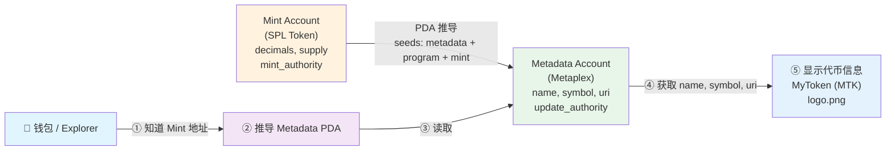
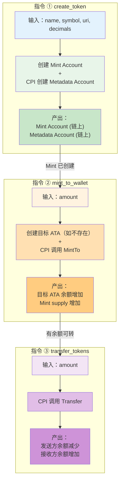
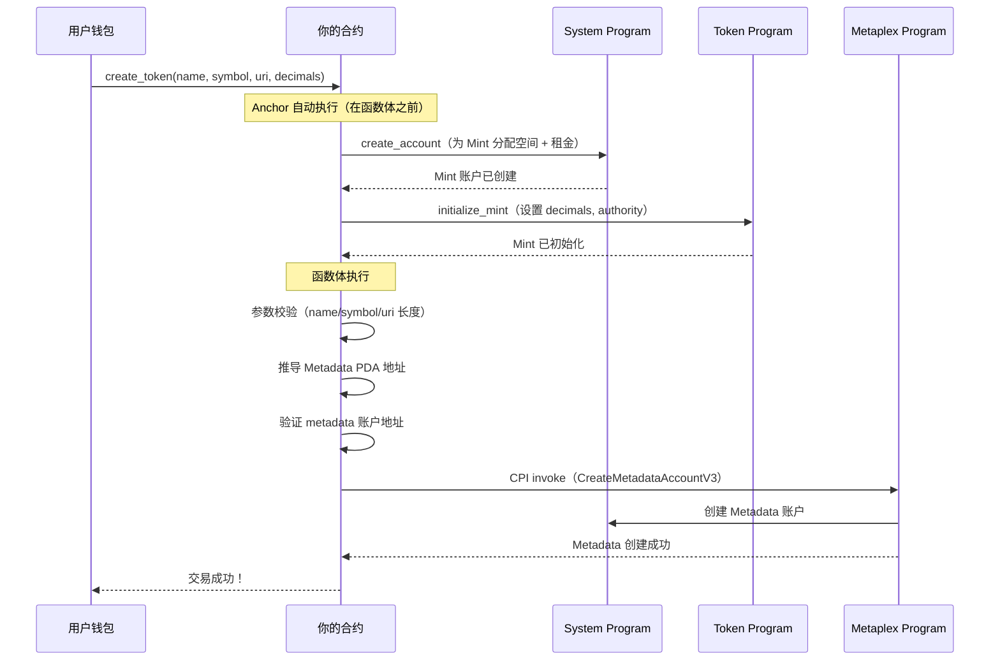
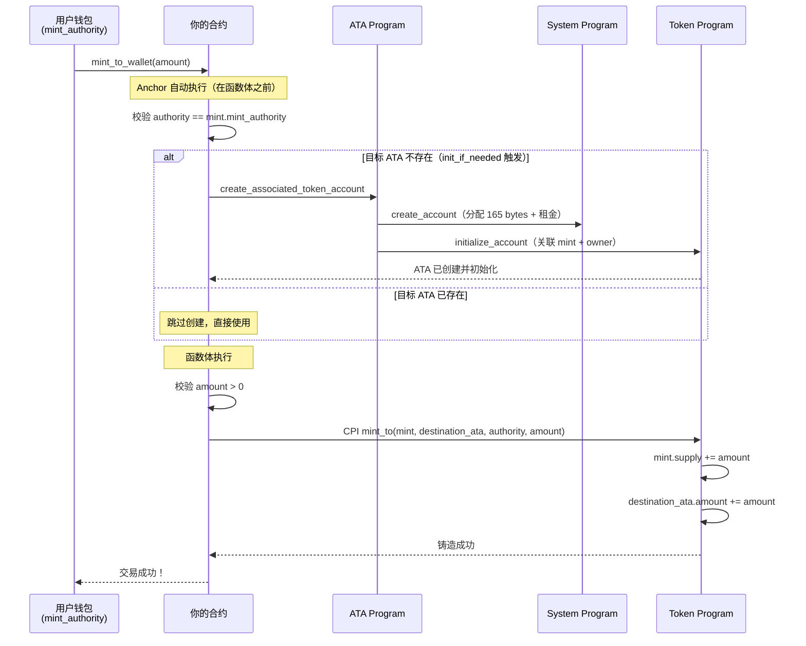
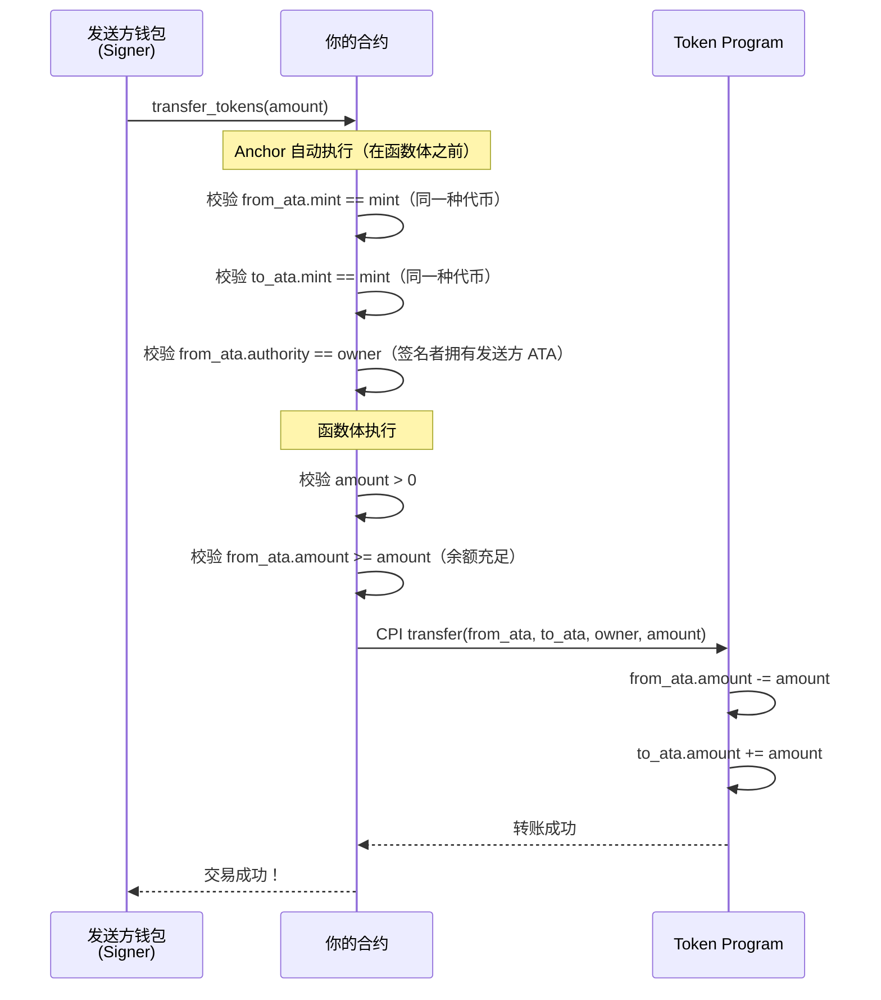
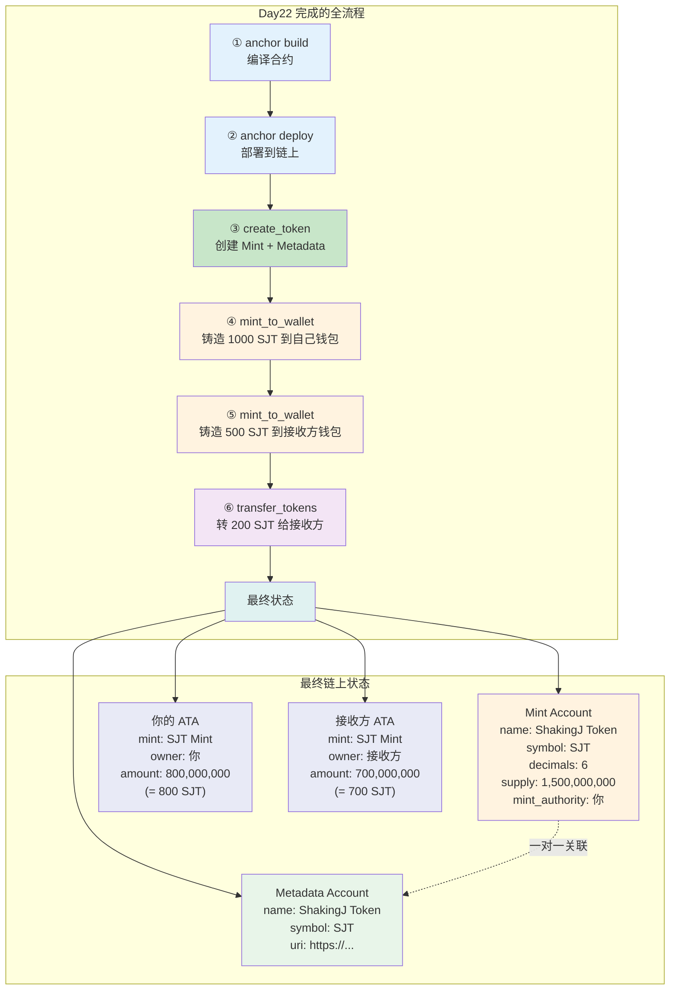

# Day22 学习指南：发行自己的 SPL 代币 — Anchor 实战 + Metaplex 元数据

## 学习目标

- 用 Anchor 代码（不是 CLI）完成代币发行的全流程
- 掌握 Metaplex Token Metadata 标准（为代币添加名称、符号、图标）
- 理解 Metadata Account 的数据结构和 PDA 推导规则
- 实现完整的代币合约：创建 Mint → 添加元数据 → 铸造 → 转账
- 编写覆盖全流程的 TypeScript 测试脚本
- 目标产出：**钱包里有自己发行的代币**（能在 Solana Explorer 上看到名称和符号）

## 预计用时

5-6 小时

## 前置要求

```
Day21 已完成：
  ✅ 理解 SPL Token Program 的"一切皆账户"设计
  ✅ 掌握 Mint Account 结构（82 bytes：authority, supply, decimals）
  ✅ 掌握 Token Account 结构（165 bytes：mint, owner, amount）
  ✅ 理解 ATA 机制（PDA 推导：wallet + token_program + mint）
  ✅ 理解代币生命周期（创建 Mint → 创建 ATA → 铸造 → 转账 → 销毁）
  ✅ 使用 CLI 完成过 spl-token create-token / mint / transfer 操作

Day18-19 已完成：
  ✅ 掌握 Anchor 指令设计与 CPI 调用
  ✅ 掌握 CpiContext::new 和 CpiContext::new_with_signer
  ✅ 理解 PDA 签名机制（seeds + bump）
```

---

## 一、Day21 → Day22 的跨越

```
Day21 你做到的事情：
  理解了 SPL Token 的三大核心概念：Mint、Token Account、ATA
  用 CLI 完成了代币的创建、铸造、转账、销毁
  → 你已经知道"SPL Token 是什么、怎么用"

  但有两个问题：
  1. CLI 操作不等于代码实现 → 真实项目中需要用 Anchor 合约来操作
  2. 你的代币没有名字！→ CLI 创建的代币只有地址，没有 name/symbol/logo

Day22 要做的事：
  1. 用 Anchor 代码创建 Mint Account（不用 CLI）
  2. 用 Metaplex Token Metadata 给代币加名字、符号、图标
  3. 铸造代币到自己的 ATA
  4. 写 TypeScript 测试脚本验证全流程
  → 完成后，你在 Solana Explorer 上能看到一个有名字、有符号的自己的代币！

Java 类比：
  Day21 = 你学会了用 MySQL 命令行建表、插数据（理解原理）
  Day22 = 你用 Spring Boot + JPA 代码来建表、插数据（工程化实现）
         + 给数据库表加了注释和文档（Metaplex = 代币的文档系统）
```

---

## 二、为什么代币需要元数据（Metaplex）

### 2.1 SPL Token 的"先天缺陷"

```
Day21 学过：SPL Token 的 Mint Account 只存了 5 个字段：
  · mint_authority
  · supply
  · decimals
  · is_initialized
  · freeze_authority

注意到了吗？没有 name、symbol、logo！

→ 如果只靠 SPL Token，你的代币在钱包里显示的是：
  "Unknown Token (7xKXtg...gAsU)"
  → 没有名字、没有符号、没有图标
  → 就像一张没有标签的银行卡 → 用户不知道这是什么币

以太坊 ERC-20 的做法：
  → name()、symbol()、decimals() 直接写在合约代码里
  → 钱包调用合约方法就能获取

Solana 的做法：
  → SPL Token 不存元数据（保持简洁）
  → 元数据由独立的 Metaplex Token Metadata 程序管理
  → 职责分离：Token Program 管代币逻辑，Metaplex 管代币信息
```

### 2.2 Metaplex Token Metadata 是什么

```
Metaplex Token Metadata = Solana 上的代币元数据标准
  → 一个已部署在链上的程序
  → 程序地址：metaqbxxUerdq28cj1RbAWkYQm3ybzjb6a8bt518x1s
  → 所有主流钱包（Phantom、Solflare）和浏览器（Solana Explorer）都支持

它的作用：
  为每一个 Mint Account 创建一个对应的 Metadata Account
  → Metadata Account 存储代币的名称、符号、图标 URI 等信息
  → 钱包通过读取 Metadata Account 来显示代币信息

关系：
  Mint Account (SPL Token)  ← 一对一 →  Metadata Account (Metaplex)
  管代币逻辑（supply 等）                管代币信息（name 等）

Java 类比：
  SPL Token = Entity 类（存业务数据）
  Metaplex = Swagger/OpenAPI 注解（存接口文档）
  → Entity 本身能运行，但加了注解后更易被外部工具识别
```

### 2.3 Metadata Account 的 PDA 推导

```
Metadata Account 的地址是一个 PDA，推导规则如下：

seeds = [
    "metadata",                    // 固定字符串前缀
    Metaplex Program ID,           // metaqbxxUerdq28cj1RbAWkYQm3ybzjb6a8bt518x1s
    Mint Account 地址,             // 代币的 Mint 地址
]
program_id = Metaplex Token Metadata Program

→ 给定一个 Mint 地址，任何人都能推导出它对应的 Metadata Account 地址
→ 这和 ATA 的推导逻辑类似（确定性 PDA）

为什么用 PDA？
  → 保证一个 Mint 只有一个 Metadata Account（唯一性）
  → 任何人都能找到某个代币的元数据（可发现性）
  → 不需要在 Mint Account 里加字段（向后兼容）
```



---

## 三、Metadata Account 数据结构

### 3.1 核心字段

```rust
// Metadata Account 数据结构（简化版，帮你理解核心字段）
pub struct Metadata {
    /// 固定标记 — 标识这是一个 Metadata Account
    pub key: Key,                    // 1 byte

    /// 更新权限 — 谁有权修改这个 Metadata（通常是代币创建者）
    pub update_authority: Pubkey,    // 32 bytes

    /// 关联的 Mint — 这个 Metadata 描述的是哪个代币
    pub mint: Pubkey,                // 32 bytes

    /// 代币数据
    pub data: Data,                  // 可变长度（见下方）

    // ... 还有其他字段（is_mutable, primary_sale_happened 等）
}

/// 代币数据 — 存名称、符号、URI
pub struct Data {
    /// 代币名称 — 如 "USD Coin"、"Wrapped SOL"
    pub name: String,        // 最大 32 字符

    /// 代币符号 — 如 "USDC"、"SOL"、"MTK"
    pub symbol: String,      // 最大 10 字符

    /// 元数据 URI — 指向链下 JSON 文件（存详细信息和图片）
    pub uri: String,         // 最大 200 字符

    /// 版税基点 — 用于 NFT（普通代币设为 0）
    pub seller_fee_basis_points: u16,  // 0-10000（100 = 1%）

    /// 创作者列表 — 用于 NFT（普通代币可为空）
    pub creators: Option<Vec<Creator>>,
}
```

### 3.2 URI 和链下元数据

```
为什么需要 URI？
  → 链上空间非常贵（每 byte 都要付租金）
  → 代币的 logo 图片可能几十 KB → 不可能存在链上
  → 解决方案：链上只存一个 URI（URL），指向链下的 JSON 文件

URI 指向的 JSON 格式（遵循 Metaplex 标准）：
{
    "name": "My Awesome Token",
    "symbol": "MAT",
    "description": "这是我发行的第一个 SPL 代币",
    "image": "https://arweave.net/xxxxx/logo.png",
    "external_url": "https://mytoken.com",
    "attributes": [],
    "properties": {
        "files": [
            {
                "uri": "https://arweave.net/xxxxx/logo.png",
                "type": "image/png"
            }
        ]
    }
}

URI 托管选择：
  · Arweave — 永久存储（推荐，一次付费永久在线）
  · IPFS — 去中心化存储（需要 pinning 服务）
  · 普通 HTTPS — 中心化（开发测试用，生产不推荐）

开发/测试阶段：
  → 可以先用一个公开的图片 URL 或留空
  → 上线前再切换到 Arweave / IPFS
```

### 3.3 update_authority 的含义

```
update_authority = 谁有权修改 Metadata

三种典型场景：
  1. update_authority = 创建者钱包
     → 创建者可以随时修改代币名称、符号、URI
     → 适用于：开发阶段、需要运营更新的代币

  2. update_authority = 某个 PDA
     → 只有特定合约逻辑才能修改
     → 适用于：DAO 治理的代币

  3. is_mutable = false（冻结元数据）
     → 一旦设置，任何人都不能再修改元数据
     → 适用于：正式上线后锁定的代币
     → ⚠️ 不可逆操作！

Java 类比：
  update_authority ≈ 数据库的 ALTER TABLE 权限
  is_mutable = false ≈ 把表结构设为只读（永久锁定 schema）
```

---

## 四、项目搭建

### 4.1 创建 Anchor 项目

```bash
# 创建新的 Anchor 项目
anchor init my-spl-token
cd my-spl-token

# 项目结构：
# my-spl-token/
# ├── Anchor.toml          # Anchor 配置
# ├── Cargo.toml           # Rust workspace
# ├── programs/
# │   └── my-spl-token/
# │       ├── Cargo.toml   # 合约依赖
# │       └── src/
# │           └── lib.rs   # 合约代码
# └── tests/
#     └── my-spl-token.ts  # 测试脚本
```

### 4.2 配置 Cargo.toml（合约依赖）

```toml
# programs/my-spl-token/Cargo.toml

[package]
name = "my-spl-token"
version = "0.1.0"
edition = "2021"

[lib]
crate-type = ["cdylib", "lib"]

[dependencies]
anchor-lang = { version = "0.30.1", features = ["init-if-needed"] }
anchor-spl = "0.30.1"                    # SPL Token + ATA 封装
mpl-token-metadata = "4.1.2"             # Metaplex Token Metadata CPI

# 依赖说明：
# anchor-lang        → Anchor 框架核心
# anchor-spl         → SPL Token / ATA 的 Anchor 封装（Day21 学过）
# mpl-token-metadata → Metaplex 元数据程序的 Rust CPI 库
#                       提供 CreateMetadataAccountV3 等指令
```

### 4.3 配置 Anchor.toml

```toml
[features]
seeds = false
skip-lint = false

[programs.localnet]
my_spl_token = "你的程序ID"   # anchor keys list 获取

[registry]
url = "https://api.apr.dev"

[provider]
cluster = "Localnet"
wallet = "~/.config/solana/id.json"

[scripts]
test = "yarn run ts-mocha -p ./tsconfig.json -t 1000000 tests/**/*.ts"
```

---

## 五、合约代码 — 完整实现

### 5.1 整体架构

```
我们的合约需要实现 3 个指令：

1. create_token    — 创建 Mint Account + Metadata Account
                     → 一个交易同时完成"定义代币 + 添加元信息"

2. mint_to_wallet  — 铸造代币到指定钱包的 ATA
                     → ATA 不存在则自动创建（init_if_needed）

3. transfer_tokens — 从一个钱包转代币到另一个钱包
                     → 演示代币转账的完整流程
```



### 5.2 合约完整代码（lib.rs）

```rust
// programs/my-spl-token/src/lib.rs

use anchor_lang::prelude::*;                          // Anchor 核心
use anchor_spl::{
    associated_token::AssociatedToken,                 // ATA Program
    token::{self, Mint, MintTo, Token, TokenAccount, Transfer},  // SPL Token 相关
};
use mpl_token_metadata::{
    instructions::CreateMetadataAccountV3,             // Metaplex 创建元数据指令
    types::DataV2,                                     // 元数据数据结构
    ID as METADATA_PROGRAM_ID,                         // Metaplex 程序 ID
};

// 声明合约 ID（anchor keys list 获取，部署前替换）
declare_id!("你的程序ID");

#[program]
pub mod my_spl_token {
    use super::*;

    /// 指令 ①：创建代币（Mint + Metadata）
    /// → 一个交易里同时完成：创建 Mint Account + 创建 Metadata Account
    pub fn create_token(
        ctx: Context<CreateToken>,
        name: String,          // 代币名称，如 "ShakingJ Token"
        symbol: String,        // 代币符号，如 "SJT"
        uri: String,           // 元数据 URI（指向 JSON 文件）
        decimals: u8,          // 精度，如 6
    ) -> Result<()> {
        // ========== 参数校验 ==========
        // Metaplex 对字段长度有限制，超出会导致交易失败
        require!(name.len() <= 32, CustomError::NameTooLong);        // 名称最多 32 字符
        require!(symbol.len() <= 10, CustomError::SymbolTooLong);    // 符号最多 10 字符
        require!(uri.len() <= 200, CustomError::UriTooLong);         // URI 最多 200 字符

        // ========== 步骤 1：Mint Account 已由 Anchor 自动创建 ==========
        // #[account(init, ...)] 约束在 CreateToken struct 中
        // → Anchor 在执行这个函数之前，已经完成了：
        //   1. 创建新账户（system_program.create_account）
        //   2. 初始化为 Mint（token_program.initialize_mint）
        // → 到这里，Mint Account 已经存在且已初始化
        msg!("Mint Account 创建成功: {}", ctx.accounts.mint.key());

        // ========== 步骤 2：CPI 调用 Metaplex 创建 Metadata Account ==========
        // Metadata Account 的 PDA 地址需要手动推导
        // ⚠️ 必须先用 let 绑定 key()，否则临时值会在本行结束后被丢弃
        // 而 metadata_seeds 还在借用它 → 编译报错 E0716（temporary value dropped while borrowed）
        // Java 类比：相当于匿名对象被 GC 了但你还持有它的引用 → Rust 在编译期就阻止这种悬空引用
        let mint_key = ctx.accounts.mint.key();   // 先绑定到变量，延长生命周期到整个函数作用域
        let metadata_seeds = &[
            b"metadata",                                          // 固定前缀
            METADATA_PROGRAM_ID.as_ref(),                         // Metaplex Program ID
            mint_key.as_ref(),                                    // Mint 地址（从变量借用，生命周期足够长）
        ];
        // 推导 PDA 地址（由 Metaplex 程序拥有）
        let (metadata_pda, _bump) = Pubkey::find_program_address(
            metadata_seeds,
            &METADATA_PROGRAM_ID,
        );

        // 验证传入的 metadata 账户地址是否正确
        require_keys_eq!(
            ctx.accounts.metadata.key(),   // 用户传入的地址
            metadata_pda,                  // 我们推导出的地址
            CustomError::InvalidMetadata   // 不匹配则报错
        );

        // 构建 Metaplex 的 CreateMetadataAccountV3 指令
        let create_metadata_ix = CreateMetadataAccountV3 {
            metadata: ctx.accounts.metadata.key(),           // Metadata PDA 地址
            mint: ctx.accounts.mint.key(),                   // 关联的 Mint
            mint_authority: ctx.accounts.authority.key(),     // Mint 的 authority
            payer: ctx.accounts.authority.key(),              // 付租金的人
            update_authority: (ctx.accounts.authority.key(), true), // 元数据更新权限 + 是否是签名者
            system_program: ctx.accounts.system_program.key(),
            rent: Some(ctx.accounts.rent.key()),
        };

        // 构建指令数据
        let data_v2 = DataV2 {
            name,                         // 代币名称
            symbol,                       // 代币符号
            uri,                          // 链下元数据 URI
            seller_fee_basis_points: 0,   // 版税（普通代币设 0，NFT 才需要）
            creators: None,               // 创作者（普通代币不需要）
            collection: None,             // 所属集合（NFT 才需要）
            uses: None,                   // 使用次数限制（NFT 才需要）
        };

        // 构建完整的 CPI 指令
        let ix = create_metadata_ix.instruction(
            mpl_token_metadata::instructions::CreateMetadataAccountV3InstructionArgs {
                data: data_v2,
                is_mutable: true,    // 允许后续修改元数据
                collection_details: None,
            },
        );

        // 准备 CPI 调用的账户列表
        let account_infos = vec![
            ctx.accounts.metadata.to_account_info(),         // Metadata Account（将被创建）
            ctx.accounts.mint.to_account_info(),             // Mint Account
            ctx.accounts.authority.to_account_info(),        // mint_authority + payer
            ctx.accounts.system_program.to_account_info(),   // System Program
            ctx.accounts.rent.to_account_info(),             // Rent Sysvar
        ];

        // 执行 CPI（跨程序调用 Metaplex）
        anchor_lang::solana_program::program::invoke(
            &ix,                // 指令
            &account_infos,     // 账户列表
        )?;

        msg!("Metadata Account 创建成功");
        msg!("代币创建完成！Mint: {}", ctx.accounts.mint.key());

        Ok(())
    }

    /// 指令 ②：铸造代币到指定钱包
    /// → 自动创建目标 ATA（如不存在）
    /// → CPI 调用 Token Program 的 MintTo
    pub fn mint_to_wallet(
        ctx: Context<MintToWallet>,
        amount: u64,           // raw amount（已包含 decimals，如 100 * 10^6）
    ) -> Result<()> {
        // 参数校验：amount 不能为 0
        require!(amount > 0, CustomError::ZeroAmount);

        // ========== ATA 已由 Anchor 自动创建（init_if_needed） ==========
        // 如果目标钱包还没有这个代币的 ATA，Anchor 会自动创建
        // 如果已经有了，就跳过创建步骤

        // ========== CPI 调用 Token Program 铸造代币 ==========
        let cpi_accounts = MintTo {
            mint: ctx.accounts.mint.to_account_info(),                    // Mint Account
            to: ctx.accounts.destination_ata.to_account_info(),           // 目标 ATA
            authority: ctx.accounts.authority.to_account_info(),          // mint_authority（签名者）
        };
        let cpi_ctx = CpiContext::new(
            ctx.accounts.token_program.to_account_info(),    // Token Program
            cpi_accounts,
        );
        token::mint_to(cpi_ctx, amount)?;     // 执行铸造

        msg!(
            "铸造成功！{} 代币 → {}",
            amount,
            ctx.accounts.destination_ata.key()
        );

        Ok(())
    }

    /// 指令 ③：转账代币
    /// → 从发送方的 ATA 转到接收方的 ATA
    pub fn transfer_tokens(
        ctx: Context<TransferTokens>,
        amount: u64,
    ) -> Result<()> {
        require!(amount > 0, CustomError::ZeroAmount);

        // 检查发送方余额是否足够
        require!(
            ctx.accounts.from_ata.amount >= amount,
            CustomError::InsufficientBalance
        );

        // CPI 调用 Token Program 转账
        let cpi_accounts = Transfer {
            from: ctx.accounts.from_ata.to_account_info(),       // 发送方 ATA
            to: ctx.accounts.to_ata.to_account_info(),           // 接收方 ATA
            authority: ctx.accounts.owner.to_account_info(),     // 发送方钱包（签名者）
        };
        let cpi_ctx = CpiContext::new(
            ctx.accounts.token_program.to_account_info(),
            cpi_accounts,
        );
        token::transfer(cpi_ctx, amount)?;

        msg!(
            "转账成功！{} → {} (数量: {})",
            ctx.accounts.from_ata.key(),
            ctx.accounts.to_ata.key(),
            amount
        );

        Ok(())
    }
}

// =============================================
// 账户结构定义
// =============================================

/// 指令 ① 的账户结构：创建 Mint + Metadata
#[derive(Accounts)]
#[instruction(name: String, symbol: String, uri: String, decimals: u8)]
pub struct CreateToken<'info> {
    /// Mint Account — 代币的"模具"
    /// init: 创建新账户
    /// payer: authority 出租金
    /// mint::decimals: 精度由参数传入
    /// mint::authority: 铸币权限设为 authority
    #[account(
        init,
        payer = authority,
        mint::decimals = decimals,
        mint::authority = authority.key(),
    )]
    pub mint: Account<'info, Mint>,

    /// Metadata Account — 由 Metaplex 管理的 PDA
    /// 我们不用 Anchor 的 init（因为 Metaplex 自己创建），所以用 UncheckedAccount
    /// CHECK: 地址在指令逻辑中通过 PDA 推导验证
    #[account(mut)]
    pub metadata: UncheckedAccount<'info>,

    /// 创建者 + 付款人 + mint_authority + update_authority
    /// 在这个简单版本中，一个钱包扮演所有角色
    #[account(mut)]
    pub authority: Signer<'info>,

    // ===== 系统账户 =====
    pub system_program: Program<'info, System>,           // 创建账户
    pub token_program: Program<'info, Token>,              // 初始化 Mint
    pub rent: Sysvar<'info, Rent>,                         // 租金计算

    /// Metaplex Token Metadata Program
    /// CHECK: 我们验证它的地址等于 Metaplex 程序 ID
    #[account(
        constraint = token_metadata_program.key() == METADATA_PROGRAM_ID
            @ CustomError::InvalidMetadataProgram
    )]
    pub token_metadata_program: UncheckedAccount<'info>,
}

/// 指令 ② 的账户结构：铸造代币到钱包
#[derive(Accounts)]
pub struct MintToWallet<'info> {
    /// Mint Account — 要铸造哪种代币（必须是 mut，因为 supply 会增加）
    #[account(mut)]
    pub mint: Account<'info, Mint>,

    /// 目标 ATA — 代币铸造到这里
    /// init_if_needed: 如果 ATA 不存在就自动创建
    /// associated_token::mint: 关联到哪个 Mint
    /// associated_token::authority: ATA 归谁所有
    #[account(
        init_if_needed,
        payer = authority,
        associated_token::mint = mint,
        associated_token::authority = destination_wallet,
    )]
    pub destination_ata: Account<'info, TokenAccount>,

    /// 目标钱包地址 — ATA 的 owner（不需要签名，因为铸币不需要接收方同意）
    /// CHECK: 任何公钥都可以接收代币
    pub destination_wallet: UncheckedAccount<'info>,

    /// mint_authority — 必须是 Mint 的 mint_authority（签名者）
    #[account(
        mut,
        constraint = authority.key() == mint.mint_authority.unwrap()
            @ CustomError::UnauthorizedMinter
    )]
    pub authority: Signer<'info>,

    // ===== 系统账户 =====
    pub system_program: Program<'info, System>,
    pub token_program: Program<'info, Token>,
    pub associated_token_program: Program<'info, AssociatedToken>,
}

/// 指令 ③ 的账户结构：转账代币
#[derive(Accounts)]
pub struct TransferTokens<'info> {
    pub mint: Account<'info, Mint>,

    /// 发送方 ATA
    #[account(
        mut,
        associated_token::mint = mint,
        associated_token::authority = owner,
    )]
    pub from_ata: Account<'info, TokenAccount>,

    /// 接收方 ATA（必须已存在；也可改为 init_if_needed）
    #[account(
        mut,
        associated_token::mint = mint,
        associated_token::authority = to_wallet,
    )]
    pub to_ata: Account<'info, TokenAccount>,

    /// 接收方钱包地址
    /// CHECK: 任何公钥都可以接收代币
    pub to_wallet: UncheckedAccount<'info>,

    /// 发送方钱包（签名者 = from_ata 的 authority）
    pub owner: Signer<'info>,

    pub token_program: Program<'info, Token>,
}

// =============================================
// 自定义错误码
// =============================================

#[error_code]
pub enum CustomError {
    #[msg("代币名称不能超过 32 个字符")]
    NameTooLong,

    #[msg("代币符号不能超过 10 个字符")]
    SymbolTooLong,

    #[msg("URI 不能超过 200 个字符")]
    UriTooLong,

    #[msg("铸造/转账数量必须大于 0")]
    ZeroAmount,

    #[msg("余额不足")]
    InsufficientBalance,

    #[msg("不是授权的铸币者")]
    UnauthorizedMinter,

    #[msg("Metadata 账户地址不匹配")]
    InvalidMetadata,

    #[msg("Token Metadata 程序地址不正确")]
    InvalidMetadataProgram,
}
```

### 5.3 代码逐段解读

#### create_token 指令的执行流程



#### mint_to_wallet 指令的执行流程



#### mint_to_wallet 指令的关键点

```
关键点 1：init_if_needed 的作用
  → 如果目标钱包的 ATA 已经存在 → 跳过创建，直接使用
  → 如果目标钱包的 ATA 不存在 → 自动创建，authority（铸币者）支付租金
  → 这让铸币操作更简洁，不需要分两步

关键点 2：authority 校验
  constraint = authority.key() == mint.mint_authority.unwrap()
  → 确保调用者是 Mint 的 mint_authority
  → 如果不是，交易直接失败（UnauthorizedMinter）

关键点 3：amount 是 raw amount
  → 如果 decimals = 6，想铸造 100 个代币
  → 前端传 amount = 100_000_000（100 × 10^6）
  → 合约不会帮你做换算！这是前端的责任
```

#### transfer_tokens 指令的执行流程



#### transfer_tokens 指令的关键点

```
关键点 1：associated_token::mint 和 associated_token::authority 约束
  → 确保 from_ata 和 to_ata 都关联到同一个 Mint
  → 确保 from_ata 的 authority 是 owner（签名者）
  → Anchor 自动校验，不需要手动 require!

关键点 2：接收方 ATA 必须已存在
  → 本例中 to_ata 没有 init_if_needed
  → 如果接收方没有 ATA，交易会失败
  → 实际项目中可以加 init_if_needed 让发送方代付 ATA 租金

关键点 3：owner 必须是 Signer
  → 只有代币持有人才能发起转账
  → Token Program 会额外校验 authority 是否匹配
```

---

## 六、TypeScript 测试脚本

### 6.1 完整测试代码

```typescript
// tests/my-spl-token.ts

import * as anchor from "@coral-xyz/anchor";
import { Program } from "@coral-xyz/anchor";
import { MySplToken } from "../target/types/my_spl_token";
import {
    Keypair,
    PublicKey,
    SystemProgram,
    SYSVAR_RENT_PUBKEY,
} from "@solana/web3.js";
import {
    TOKEN_PROGRAM_ID,
    ASSOCIATED_TOKEN_PROGRAM_ID,
    getAssociatedTokenAddress,
    getAccount,
    getMint,
} from "@solana/spl-token";
import { assert } from "chai";

// Metaplex Token Metadata Program ID（固定值）
const METADATA_PROGRAM_ID = new PublicKey(
    "metaqbxxUerdq28cj1RbAWkYQm3ybzjb6a8bt518x1s"
);

describe("my-spl-token", () => {
    // ===== 初始化测试环境 =====
    const provider = anchor.AnchorProvider.env();
    anchor.setProvider(provider);
    const program = anchor.workspace.MySplToken as Program<MySplToken>;

    // 测试用的 Keypair
    const authority = provider.wallet;                   // 使用默认钱包作为 authority
    const mintKeypair = Keypair.generate();               // 生成新的 Mint Keypair
    const receiver = Keypair.generate();                  // 生成接收方钱包

    // 代币参数
    const TOKEN_NAME = "ShakingJ Token";
    const TOKEN_SYMBOL = "SJT";
    const TOKEN_URI = "https://raw.githubusercontent.com/example/metadata.json";
    const TOKEN_DECIMALS = 6;

    // 辅助函数：推导 Metadata PDA 地址
    async function getMetadataPDA(mint: PublicKey): Promise<PublicKey> {
        const [pda] = PublicKey.findProgramAddressSync(
            [
                Buffer.from("metadata"),             // 固定前缀
                METADATA_PROGRAM_ID.toBuffer(),      // Metaplex Program ID
                mint.toBuffer(),                     // Mint 地址
            ],
            METADATA_PROGRAM_ID                      // PDA 的拥有者程序
        );
        return pda;
    }

    // ===== 测试 ①：创建代币 =====
    it("创建代币（Mint + Metadata）", async () => {
        // 推导 Metadata PDA
        const metadataPDA = await getMetadataPDA(mintKeypair.publicKey);

        // 调用合约的 create_token 指令
        const tx = await program.methods
            .createToken(
                TOKEN_NAME,       // name
                TOKEN_SYMBOL,     // symbol
                TOKEN_URI,        // uri
                TOKEN_DECIMALS    // decimals
            )
            .accounts({
                mint: mintKeypair.publicKey,                        // 新的 Mint 地址
                metadata: metadataPDA,                              // Metadata PDA
                authority: authority.publicKey,                      // 创建者
                systemProgram: SystemProgram.programId,
                tokenProgram: TOKEN_PROGRAM_ID,
                rent: SYSVAR_RENT_PUBKEY,
                tokenMetadataProgram: METADATA_PROGRAM_ID,
            })
            .signers([mintKeypair])      // Mint 是新创建的 Keypair，需要签名
            .rpc();

        console.log("创建代币交易:", tx);
        console.log("Mint 地址:", mintKeypair.publicKey.toBase58());
        console.log("Metadata 地址:", metadataPDA.toBase58());

        // 验证 Mint Account
        const mintInfo = await getMint(
            provider.connection,
            mintKeypair.publicKey
        );
        assert.equal(mintInfo.decimals, TOKEN_DECIMALS, "精度应为 6");
        assert.equal(mintInfo.supply.toString(), "0", "初始供应量应为 0");
        assert.equal(
            mintInfo.mintAuthority?.toBase58(),
            authority.publicKey.toBase58(),
            "mint_authority 应为 authority"
        );

        console.log("✅ Mint Account 验证通过");

        // 验证 Metadata Account 是否存在（通过检查 accountInfo 是否非空）
        const metadataAccountInfo = await provider.connection.getAccountInfo(metadataPDA);
        assert.isNotNull(metadataAccountInfo, "Metadata Account 应存在");
        assert.equal(
            metadataAccountInfo!.owner.toBase58(),
            METADATA_PROGRAM_ID.toBase58(),
            "Metadata 的 owner 应为 Metaplex Program"
        );

        console.log("✅ Metadata Account 验证通过");
    });

    // ===== 测试 ②：铸造代币到自己的钱包 =====
    it("铸造 1000 个代币到自己的钱包", async () => {
        const mintAmount = 1000;
        // raw amount = 1000 × 10^6 = 1_000_000_000
        const rawAmount = new anchor.BN(mintAmount * Math.pow(10, TOKEN_DECIMALS));

        // 获取 authority 的 ATA 地址
        const authorityATA = await getAssociatedTokenAddress(
            mintKeypair.publicKey,        // Mint
            authority.publicKey           // 钱包
        );

        const tx = await program.methods
            .mintToWallet(rawAmount)
            .accounts({
                mint: mintKeypair.publicKey,
                destinationAta: authorityATA,
                destinationWallet: authority.publicKey,
                authority: authority.publicKey,
                systemProgram: SystemProgram.programId,
                tokenProgram: TOKEN_PROGRAM_ID,
                associatedTokenProgram: ASSOCIATED_TOKEN_PROGRAM_ID,
            })
            .rpc();

        console.log("铸造交易:", tx);

        // 验证余额
        const ataInfo = await getAccount(provider.connection, authorityATA);
        assert.equal(
            ataInfo.amount.toString(),
            rawAmount.toString(),
            `ATA 余额应为 ${rawAmount}`
        );

        // 验证总供应量
        const mintInfo = await getMint(provider.connection, mintKeypair.publicKey);
        assert.equal(
            mintInfo.supply.toString(),
            rawAmount.toString(),
            `总供应量应为 ${rawAmount}`
        );

        console.log(`✅ 铸造成功！余额: ${mintAmount} ${TOKEN_SYMBOL}`);
        console.log(`   raw amount: ${rawAmount.toString()}`);
    });

    // ===== 测试 ③：铸造代币到其他钱包 =====
    it("铸造 500 个代币到接收方钱包", async () => {
        const mintAmount = 500;
        const rawAmount = new anchor.BN(mintAmount * Math.pow(10, TOKEN_DECIMALS));

        const receiverATA = await getAssociatedTokenAddress(
            mintKeypair.publicKey,
            receiver.publicKey
        );

        const tx = await program.methods
            .mintToWallet(rawAmount)
            .accounts({
                mint: mintKeypair.publicKey,
                destinationAta: receiverATA,
                destinationWallet: receiver.publicKey,
                authority: authority.publicKey,
                systemProgram: SystemProgram.programId,
                tokenProgram: TOKEN_PROGRAM_ID,
                associatedTokenProgram: ASSOCIATED_TOKEN_PROGRAM_ID,
            })
            .rpc();

        console.log("铸造到接收方交易:", tx);

        // 验证接收方余额
        const ataInfo = await getAccount(provider.connection, receiverATA);
        assert.equal(
            ataInfo.amount.toString(),
            rawAmount.toString(),
            `接收方余额应为 ${rawAmount}`
        );

        // 验证总供应量增加了
        const mintInfo = await getMint(provider.connection, mintKeypair.publicKey);
        const expectedTotalSupply = new anchor.BN(1500 * Math.pow(10, TOKEN_DECIMALS));
        assert.equal(
            mintInfo.supply.toString(),
            expectedTotalSupply.toString(),
            "总供应量应为 1500 × 10^6"
        );

        console.log(`✅ 铸造到接收方成功！接收方余额: ${mintAmount} ${TOKEN_SYMBOL}`);
    });

    // ===== 测试 ④：转账代币 =====
    it("从自己的钱包转 200 个代币给接收方", async () => {
        const transferAmount = 200;
        const rawAmount = new anchor.BN(transferAmount * Math.pow(10, TOKEN_DECIMALS));

        const authorityATA = await getAssociatedTokenAddress(
            mintKeypair.publicKey,
            authority.publicKey
        );
        const receiverATA = await getAssociatedTokenAddress(
            mintKeypair.publicKey,
            receiver.publicKey
        );

        // 转账前余额
        const beforeFrom = await getAccount(provider.connection, authorityATA);
        const beforeTo = await getAccount(provider.connection, receiverATA);
        console.log(`转账前 - 发送方: ${beforeFrom.amount}, 接收方: ${beforeTo.amount}`);

        const tx = await program.methods
            .transferTokens(rawAmount)
            .accounts({
                mint: mintKeypair.publicKey,
                fromAta: authorityATA,
                toAta: receiverATA,
                toWallet: receiver.publicKey,
                owner: authority.publicKey,
                tokenProgram: TOKEN_PROGRAM_ID,
            })
            .rpc();

        console.log("转账交易:", tx);

        // 验证余额变化
        const afterFrom = await getAccount(provider.connection, authorityATA);
        const afterTo = await getAccount(provider.connection, receiverATA);

        const expectedFromBalance = BigInt(beforeFrom.amount.toString()) - BigInt(rawAmount.toString());
        const expectedToBalance = BigInt(beforeTo.amount.toString()) + BigInt(rawAmount.toString());

        assert.equal(
            afterFrom.amount.toString(),
            expectedFromBalance.toString(),
            "发送方余额应减少"
        );
        assert.equal(
            afterTo.amount.toString(),
            expectedToBalance.toString(),
            "接收方余额应增加"
        );

        console.log(`✅ 转账成功！`);
        console.log(`   发送方余额: ${afterFrom.amount} (减少 ${rawAmount})`);
        console.log(`   接收方余额: ${afterTo.amount} (增加 ${rawAmount})`);
    });

    // ===== 测试 ⑤：异常场景 — 铸造数量为 0 =====
    it("铸造数量为 0 时应报错", async () => {
        const authorityATA = await getAssociatedTokenAddress(
            mintKeypair.publicKey,
            authority.publicKey
        );

        try {
            await program.methods
                .mintToWallet(new anchor.BN(0))
                .accounts({
                    mint: mintKeypair.publicKey,
                    destinationAta: authorityATA,
                    destinationWallet: authority.publicKey,
                    authority: authority.publicKey,
                    systemProgram: SystemProgram.programId,
                    tokenProgram: TOKEN_PROGRAM_ID,
                    associatedTokenProgram: ASSOCIATED_TOKEN_PROGRAM_ID,
                })
                .rpc();

            assert.fail("应该抛出错误");
        } catch (err) {
            console.log("✅ 正确拒绝了数量为 0 的铸造请求");
        }
    });

    // ===== 测试 ⑥：异常场景 — 非 authority 铸币 =====
    it("非 mint_authority 铸币时应报错", async () => {
        const fakeAuthority = Keypair.generate();
        const fakeATA = await getAssociatedTokenAddress(
            mintKeypair.publicKey,
            fakeAuthority.publicKey
        );

        try {
            await program.methods
                .mintToWallet(new anchor.BN(1000))
                .accounts({
                    mint: mintKeypair.publicKey,
                    destinationAta: fakeATA,
                    destinationWallet: fakeAuthority.publicKey,
                    authority: fakeAuthority.publicKey,    // 假冒的 authority
                    systemProgram: SystemProgram.programId,
                    tokenProgram: TOKEN_PROGRAM_ID,
                    associatedTokenProgram: ASSOCIATED_TOKEN_PROGRAM_ID,
                })
                .signers([fakeAuthority])
                .rpc();

            assert.fail("应该抛出错误");
        } catch (err) {
            console.log("✅ 正确拒绝了未授权的铸币请求");
        }
    });
});
```

### 6.2 测试脚本中的关键概念

```
关键概念 1：Metadata PDA 的推导
  → 前端/测试中推导方式和合约中一样
  → seeds = ["metadata", metaplex_program_id, mint_address]
  → 用 PublicKey.findProgramAddressSync() 推导

关键概念 2：raw amount 换算
  → amount = 显示数量 × 10^decimals
  → 1000 个代币（decimals=6）→ new BN(1000 * 10**6) = 1_000_000_000
  → 必须用 BN（大数）避免 JavaScript 精度问题

关键概念 3：getAssociatedTokenAddress
  → @solana/spl-token 提供的工具函数
  → 根据 (mint, wallet) 推导出 ATA 地址
  → 和链上 ATA Program 的推导规则一致

关键概念 4：signers 数组
  → create_token 需要 [mintKeypair]（因为 Mint 是新创建的 Keypair，需要签名）
  → mint_to_wallet 不需要额外 signers（authority 已由 provider.wallet 签名）
  → 非 authority 测试需要 [fakeAuthority]
```

---

## 七、构建与运行

### 7.1 构建与测试

```bash
# 确保 solana-test-validator 在另一个终端运行中
solana-test-validator

# ===== 编译合约 =====
anchor build

# ===== 获取程序 ID 并更新配置 =====
anchor keys list
# 输出：my_spl_token: 你的程序ID
# → 把这个 ID 更新到 lib.rs 的 declare_id!() 和 Anchor.toml

# ===== 再次编译（更新 ID 后） =====
anchor build

# ===== 部署到本地网络 =====
anchor deploy

# ===== 运行测试 =====
anchor test --skip-local-validator
# --skip-local-validator 因为我们已经手动启动了 validator
```

### 7.2 常见构建问题

```
❌ 问题 1：mpl-token-metadata 版本冲突
  现象：编译报错 "incompatible types"
  原因：anchor-spl 和 mpl-token-metadata 依赖的 solana-program 版本不一致
  解决：确保版本匹配，anchor-spl 0.30.1 搭配 mpl-token-metadata 4.1.2

❌ 问题 2：Metaplex Program 在本地网络不可用
  现象：CPI 调用 Metaplex 时报 "Program not found"
  原因：solana-test-validator 默认不包含 Metaplex 程序
  解决：启动 validator 时克隆 Metaplex 程序
    solana-test-validator \
      --clone metaqbxxUerdq28cj1RbAWkYQm3ybzjb6a8bt518x1s \
      --url mainnet-beta
  → 这会从 mainnet 克隆 Metaplex 程序到本地网络

❌ 问题 3：交易超大小限制
  现象：Transaction too large
  原因：name + symbol + uri 太长，导致指令数据超出交易大小限制（1232 bytes）
  解决：缩短 name/symbol/uri，特别是 URI 尽量用短链接

❌ 问题 4：init-if-needed feature 未开启
  现象：编译报错 "init_if_needed is not enabled"
  解决：确保 Cargo.toml 中有 features = ["init-if-needed"]
```

### 7.3 在 Solana Explorer 上查看

```
部署到 Devnet 后，可以在 Solana Explorer 上查看你的代币：

1. 部署到 Devnet
   solana config set --url devnet
   solana airdrop 5
   anchor deploy --provider.cluster devnet

2. 在浏览器中打开
   https://explorer.solana.com/address/<你的Mint地址>?cluster=devnet

3. 你应该能看到：
   · Token Name: ShakingJ Token
   · Token Symbol: SJT
   · Decimals: 6
   · Current Supply: （你铸造的数量）
   · Mint Authority: （你的钱包地址）

→ 你正式拥有了一个链上的、有名字的代币！
```

---

## 八、CPI 调用 Metaplex 的两种方式

### 8.1 方式对比

```
方式 1：使用 anchor_lang::solana_program::program::invoke（本教程使用）
  → 手动构建指令 + 手动传账户列表
  → 更底层，灵活性高
  → 适合学习理解 CPI 的原理

方式 2：使用 mpl-token-metadata 的 CPI 封装
  → 库提供了更简洁的 API
  → 代码更少，更不容易出错
  → 适合生产项目

两种方式的效果完全一样 → 选择取决于你想学原理还是快速开发

我们选方式 1 的原因：
  Day18-19 学过 CPI，现在用最底层的方式加深理解
  → 明白了原理后，方式 2 自然就会用了
```

### 8.2 invoke vs invoke_signed

```
本合约 create_token 中我们用的是 invoke（不是 invoke_signed）

原因：
  Metadata Account 虽然是 PDA，但它归 Metaplex 程序所有
  → Metaplex 程序自己会用内部逻辑创建 PDA（签名由 Metaplex 处理）
  → 我们的合约只是"请求" Metaplex 创建，不需要我们签名

什么时候用 invoke_signed？
  → 当你的合约自己拥有的 PDA 需要"签名"时
  → 例如 Day19 的银行合约中，PDA 账户转 SOL 出去需要 PDA 签名
  → Metaplex 创建 Metadata 不需要你签名，所以用 invoke 即可

回忆 Day19 的知识：
  invoke         → 普通 CPI（调用者不需要是 PDA）
  invoke_signed  → PDA 签名的 CPI（调用者是你的合约管理的 PDA）
```

---

## 九、代币发行全流程图



---

## 十、进阶话题：PDA 作为 Mint Authority

### 10.1 为什么需要 PDA Authority

```
当前设计：mint_authority = 你的钱包
  → 你可以随时手动铸币
  → 适合简单场景

进阶设计：mint_authority = PDA（由合约控制）
  → 铸币逻辑由合约代码控制
  → 没有人可以绕过合约直接铸币
  → 更安全、更去中心化

典型场景：
  · 挖矿奖励 → 合约根据算力/质押量自动铸币
  · 流动性激励 → 合约根据 LP 份额自动铸币
  · 游戏奖励 → 合约根据游戏逻辑自动铸币
  → 这些场景下，mint_authority 必须是合约控制的 PDA

Java 类比：
  钱包 authority = 管理员手动操作数据库（不安全）
  PDA authority   = 通过 Service 层代码操作数据库（受控）
```

### 10.2 PDA Authority 铸币示例

```rust
// ===== PDA 作为 mint_authority 的铸币 =====
// 当 mint_authority 是 PDA 时，需要用 CpiContext::new_with_signer

pub fn mint_with_pda(ctx: Context<MintWithPda>, amount: u64) -> Result<()> {
    // PDA seeds（和创建 Mint 时设置 mint_authority 的 seeds 一致）
    // ⚠️ 必须先用 let 绑定 key()，避免临时值被 drop（和 create_token 中的修复一样）
    let mint_key = ctx.accounts.mint.key();
    let seeds = &[
        b"mint-authority",                            // 固定前缀
        mint_key.as_ref(),                            // Mint 地址（从变量借用）
        &[ctx.bumps.mint_authority_pda],              // bump
    ];
    let signer_seeds = &[&seeds[..]];   // 包装成二维数组

    // 使用 new_with_signer 创建 CPI 上下文
    let cpi_accounts = MintTo {
        mint: ctx.accounts.mint.to_account_info(),
        to: ctx.accounts.destination_ata.to_account_info(),
        authority: ctx.accounts.mint_authority_pda.to_account_info(),  // PDA 作为 authority
    };
    let cpi_ctx = CpiContext::new_with_signer(
        ctx.accounts.token_program.to_account_info(),
        cpi_accounts,
        signer_seeds,     // PDA 签名
    );

    token::mint_to(cpi_ctx, amount)?;
    Ok(())
}

// 对比：
// CpiContext::new            → authority 是普通钱包（用户签名）
// CpiContext::new_with_signer → authority 是 PDA（程序签名）
// → Day19 学过的知识，这里再次应用到 SPL Token 场景
```

---

## 十一、常见陷阱与最佳实践

### 11.1 开发中的常见错误

```
❌ 错误 1：忘记克隆 Metaplex 到本地 validator
  → 本地测试时，Metaplex 程序默认不在 validator 上
  → 必须用 --clone 参数启动 validator
  → 否则 CPI 调用 Metaplex 会报 "AccountNotFound"

❌ 错误 2：Metadata PDA 地址传错
  → 前端推导的 PDA 和合约中推导的不一致
  → 最常见原因：seeds 拼错了（大小写、顺序）
  → 建议用相同的推导逻辑，或直接用 findProgramAddressSync

❌ 错误 3：name / symbol / uri 包含不可见字符
  → Metaplex 的 name 和 symbol 会在末尾填充 \0 到固定长度
  → 读取时要 trim 掉末尾的 \0
  → 这是 Metaplex 的已知行为，不是 bug

❌ 错误 4：忘记 mintKeypair 加入 signers
  → create_token 时，Mint 是新创建的 Keypair
  → Anchor 的 init 需要 Keypair 签名（证明你拥有这个地址）
  → 如果不加入 signers，交易会报 "Missing signature"

❌ 错误 5：重复创建已存在的 Mint
  → Anchor 的 init 约束要求账户不存在
  → 如果用同一个 mintKeypair 再调一次 create_token → 报错
  → 每次创建代币需要新的 Keypair
```

### 11.2 生产环境最佳实践

```
✅ 实践 1：使用 PDA 作为 mint_authority（第十节讲过）
  → 避免私钥泄露导致无限铸币

✅ 实践 2：适时放弃 mint_authority
  → 如果代币供应量已确定，将 mint_authority 设为 None
  → 向社区证明"不会增发"

✅ 实践 3：元数据 URI 使用永久存储
  → 生产用 Arweave（一次付费，永久存储）
  → 测试用 HTTPS（方便调试）

✅ 实践 4：is_mutable 最终设为 false
  → 代币上线后，锁定元数据
  → 防止被恶意修改名称/符号

✅ 实践 5：先在 Devnet 测试完毕再部署 Mainnet
  → Devnet 免费，可以反复测试
  → Mainnet 每次交易都花真金白银
```

---

## 十二、自查清单

### 概念理解

```
1. 为什么 SPL Token 原生不存储代币名称和符号？
   答：SPL Token Program 追求简洁和通用性，只处理核心代币逻辑（铸造/转账/销毁）。
       名称、符号等元数据由独立的 Metaplex Token Metadata 程序管理，
       实现了职责分离（类似于微服务架构）。

2. Metadata Account 的 PDA 如何推导？
   答：seeds = ["metadata", Metaplex_Program_ID, Mint_Address]，
       program_id = Metaplex Token Metadata Program。
       给定 Mint 地址，任何人都能推导出唯一的 Metadata PDA。

3. 代币元数据中的 URI 指向什么？
   答：URI 指向一个链下 JSON 文件，遵循 Metaplex 标准格式，
       包含 name、symbol、description、image（logo URL）等字段。
       链上只存 URI（最多 200 字符），实际内容存在 Arweave/IPFS 上。

4. create_token 指令中为什么用 invoke 而不是 invoke_signed？
   答：因为 Metadata Account 归 Metaplex 程序所有，由 Metaplex 内部创建和签名。
       我们的合约只是"请求"创建，不需要提供 PDA 签名。
       invoke_signed 只在我们合约管理的 PDA 需要签名时使用。

5. mint_to_wallet 中 init_if_needed 的作用是什么？
   答：自动处理目标 ATA 的创建 — 如果 ATA 已存在就跳过，不存在就创建。
       避免铸币前需要单独一笔交易来创建 ATA，简化流程。
       租金由 payer（authority）支付。

6. 为什么创建代币时 mintKeypair 需要加入 signers？
   答：Anchor 的 init 约束需要新账户的 Keypair 签名，
       证明调用者拥有这个地址的控制权。
       provider.wallet 自动签名，但额外的 Keypair 需要显式添加。

7. 什么场景下应该把 mint_authority 设为 PDA？
   答：当铸币逻辑需要由合约控制时（如挖矿奖励、流动性激励、游戏奖励）。
       PDA authority 确保没有人可以绕过合约逻辑直接铸币，更安全。

8. update_authority 和 mint_authority 的区别是什么？
   答：mint_authority 控制"谁能铸造代币"（SPL Token 层面）；
       update_authority 控制"谁能修改代币元数据"（Metaplex 层面）。
       两者独立设置，可以是同一个地址也可以是不同地址。

9. 测试脚本中如何验证 Metadata Account 是否创建成功？
   答：通过 getAccountInfo 检查 Metadata PDA 地址是否有数据（非空），
       并验证其 owner 是 Metaplex Program ID。
       也可以用 Metaplex JS SDK 反序列化读取具体字段。

10. transfer_tokens 中 to_ata 如果不存在会怎样？
    答：交易失败。本教程的 transfer 没有使用 init_if_needed，
        所以要求接收方 ATA 已存在。实际项目中可以添加 init_if_needed
        让发送方代付 ATA 创建租金，提升用户体验。
```

### 动手验证

```
□ 成功执行 anchor build 编译合约（无报错）
□ 使用 --clone 启动了带 Metaplex 的本地 validator
□ anchor deploy 成功部署合约
□ 测试 ① 通过：创建了 Mint + Metadata
□ 测试 ② 通过：铸造代币到自己的 ATA
□ 测试 ③ 通过：铸造代币到其他钱包的 ATA
□ 测试 ④ 通过：成功转账代币
□ 测试 ⑤ 通过：拒绝数量为 0 的铸造
□ 测试 ⑥ 通过：拒绝非授权铸币
□ 能在 Solana Explorer 上看到代币名称和符号
□ 能口述 Mint Account → Metadata Account 的 PDA 推导过程
□ 能解释 create_token 指令中 Anchor 自动做了什么、手动做了什么
```

---

## 十三、明日预告 — Day23

```
Day23：代币转账、授权、增发、销毁
  → 完善代币合约的进阶操作
  → 实现 approve / revoke（委托授权）
  → 实现 burn（销毁代币）
  → 实现增发控制（条件铸造）
  → 探索 freeze / thaw（冻结/解冻 Token Account）
  → 目标：完成代币的全套操作

Day22 → Day23 的关系：
  Day22 = 代币的"出生"（创建 + 铸造 + 基础转账）
  Day23 = 代币的"生活"（授权、增发、销毁、冻结 — 完整生命周期管理）
```
